很早就听说了 PlantUML，但是没有好好去研究和体验，以前画时序图都是在 Keynote 里自己画框勾线，稍微复杂的图修改起来实在是麻烦，各种箭头要对齐，好好研究一下 PlantUML，以备后用。

这里有一份 PlantUML 的官方文档实例和讲解，相信阅读完了，你也大概知道了其语法和使用。

[PlantUML_Language_Reference_Guide_zh.pdf](https://www.yuque.com/office/yuque/0/2020/pdf/104088/1591161574842-955c54ac-8821-4bc4-844d-002fb52e8965.pdf)

本文的目的是记录核心、关键的部分，利用这些元素绘制出我们心中的那张图，PlantUML 内容过于丰富，以至于你觉得学习并记住它是一个负担，先放下这个负担，记不住了，就回来看看就好了~

## 一、时序图

一个复杂的时序图包含了诸多元素，但是核心的就那么几个，分别是：参与者、消息、消息指向，其他的都是次要的，比如可以给「消息指向」定义序号、定义颜色、定义其他样式等等。

@startuml

参与者A -> 参与者B: 消息1
参与者B -> 参与者A: 消息2

@enduml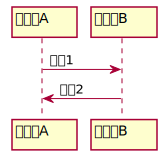图1.1 - 最简 DEMO

#### 技巧&nbsp;声明参与者
**
如果参与者比较多，而且参与者的名字也比较长，可以给参与者取个短一点的名字：
@startuml

participant 参与者A as A
participant 参与者B as B

A -> B: 消息1
B -> A: 消息2

@enduml其效果，跟 图1.1 完全一样。

#### 技巧&nbsp;参与者属性自定义
**
给参与者加个颜色、更换个顺序、再换个图标，代码是这么写的：
@startuml

' 以单引号开头是注释的意思
' 参与者有很多中图标，分别用 participant/actor/boundary/control/entity/database 来声明
' 下面这句话的意思是，声明参与者A是一个 database 实体，顺序调整为 10（默认应该是1），其颜色为 #FDF6600
database 参与者A as A order 10 #FF6600
participant 参与者B as B

A -> B: 消息1
B -> A: 消息2

@enduml那么效果就变成这样了
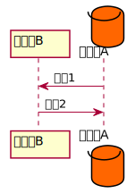图1.2 - 参与者属性自定义

这里需要注意的是，order 需要在颜色之前，否则会报错。

#### 技巧 消息的属性自定义
**
给消息定义样式、分隔、延迟消息、添加注释：
@startuml

database 参与者A as A order 10 #FF6600
participant 参与者B as B
participant 参与者C as C

' 将 -> 替换成 --> 变成了虚线，还有 ->x ->> -\ \\- //-- 等等多种线
A --> B: 消息1
' 右边添加一个注释
note right: 消息1的注释
A --> C: 消息3
' 右边添加一个注释
note right: 消息3的注释
' 这是一个消息延迟
...消息延迟...
B -> A: 消息2

@enduml效果变成了：
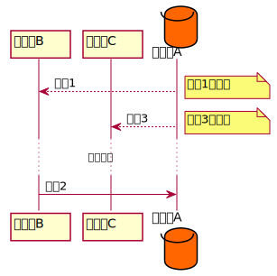图1.3 - 消息属性自定义

#### 技巧 消息的分组

将消息 1 放到分组 1，消息 2 和消息 3 放到分组2中：
@startuml

' 消息序列号自增
autonumber

database 参与者A as A order 10 #FF6600
participant 参与者B as B
' 加点效果
participant 参与者C as C << (C, #FF6600) >>

' 增加分组
== 分组1 ==
A --> B: 消息1
C -> C: 给自己发个消息

' 增加分组
== 分组2 ==
note right: 消息1的注释
A --> C: 消息3
note right: 消息3的注释
...消息延迟...
B -> A: 消息2

@enduml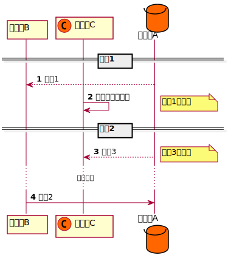图1.4 - 消息的分组

到这里，差不多就够了，还有很多其他的定义，再学就有点复杂了，如有需要可以看文章上方提供的文档。

## 二、用例图

虽然使用 PlantUML 绘制用例图比较规范，但是大多数用例图使用 Keynote 或者 PPT 绘制可控性比 PlantUML 要强，我并不推荐大家使用代码编写用例图，需要记的东西有点杂乱。

在这里只提供一个略微全面的 DEMO，包含了一些核心要求，大家看看注释和效果，对比一下就知道怎么用了。
@startuml

actor 角色A as A #FF6600
actor 角色B as B << (B, #00FF00) >>
actor 角色C as C << (C, #FF0000) >>

note "这是 A 的注释" as Na
note "这是 C 的注释" as Nc
note "这是 A 和 C 之间注释的关系 Rac" as Rac

A -> Na
A -> (AContent): A发言的标注

A <|-- B
note left of B: 这是 B 的发言

C -> Nc
C -> (CContent): C发言的标注

(AContent) .. Rac
Rac .. (CContent)

@enduml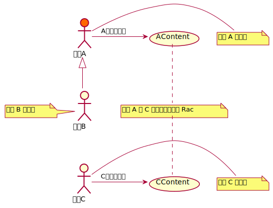图2.1 - 用例图

## 三、类图

类图用的是比较多的，也有非常专业的工具，但是如果你喜欢使用代码来表达简单的类图，PlantUML 算是首选。

类的表达和类之间关系的表达：
@startuml

' 共 15 种
' <|-- *-- o-- .. --
' <|.. --> ..> <--*
' #-- x-- }-- +-- ^--
Class01 <|-- Class02

' 关系
Class03 "1" *-- "N" Class04: 一对N关系

' 类方法和属性
class Class05 {
  ' 静态方法
    {static} String id
  ' 抽象方法
  {abstract} void methods()
  ' 私有
    -field1
  ' 保护
    #field2
  ' 包私有
    ~method1()
  ' 公开
    +method2()
}
Class05 o-- Class06
' 注释
note bottom of Class06: 这是 Class06 的注释

' enum 类型
enum TimeUnit {
DAYS
HOURS
MINUTES
}

' 标注
annotation SuppressWarnings

@enduml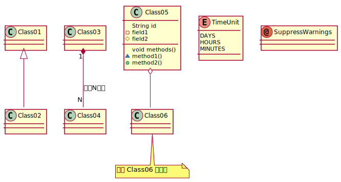图3.1 - 类关系实例

还有更多复杂的配置，请查看文档。

## 四、活动图

活动图本质还是流程图，只不过它能够表达的内容更多，一下是从网上摘录的一段区别对比：

> 活动图与流程图的区别：
> 1. 流程图着重描述处理过程，它的主要控制结构是顺序、分支和循环，各个处理过程之间有严格的顺序和时间关系。而活动图描述的是对象活动的顺序关系所遵循的规则，它着重表现的是系统的行为，而非系统的处理过程。
> 2. 活动图能够表示并发活动的情形，而流程图不行。
> 3. 活动图是面向对象的，而流程图是面向过程的。

活动图的基础表达元素还是很简单的：
@startuml

(*) -up-> 步骤1
-right-> 步骤2
note right: 步骤2的注释

if "条件一" then
  -->[Y] 分支1步骤1
  note top: 分支1步骤1的注释
  --> 分之1步骤2
  --> (*)
else
  -->[N] 分支2
  --> (*)
endif

@enduml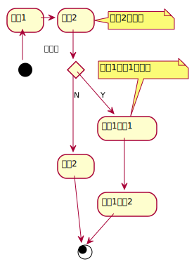图4.1 - 活动图

#### 新语法&nbsp;活动图新语法

不得不说，这个语法写起来怪怪的，可以尝试下新的活动图语法：

@startuml

start 

:步骤一;
:步骤二;
note right: 步骤2的注释

if (条件一) then (Y)
  :分支1步骤1;
  note right: 分支1步骤1的注释
  :分支1步骤2;
else (N)
  :分支2;
endif

stop

@enduml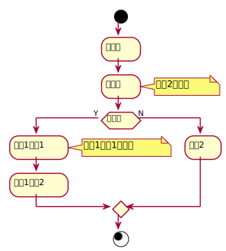图4.2 - 活动图新语法

虽然定制型稍微弱一些，但是需要表达的逻辑还是十分清晰的。

#### 技巧&nbsp;泳道图

泳道图就是给活动流程进行分区分组，增加泳道标记后，在流程上方标记流程所述泳道就行 ：

@startuml

|泳道一|
start 

:步骤一;

|#E8E8E8|泳道二|
:步骤二;
note right: 步骤2的注释

if (条件一) then (Y)
  :分支1步骤1;
  note right: 分支1步骤1的注释
  :分支1步骤2;
else (N)
  :分支2;
endif

|泳道一|
:步骤三;

stop

@enduml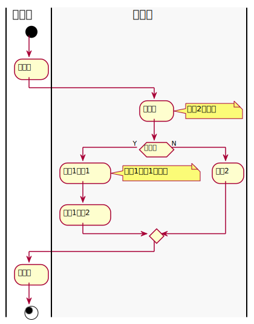图4.3 - 泳道图

## 五、其他图

其他图使用的略少，只给出一些简单的 Demo。

#### 组件图
@startuml
package "Some Group" {
    HTTP - [First Component]
    [Another Component]
}
node "Other Groups" {
  FTP - [Second Component]
  [First Component] --> FTP
}
cloud {
    [Example 1]
}
database "MySql" {
  folder "This is my folder" {
    [Folder 3]
    }
  frame "Foo" {
    [Frame 4]
  }
}
[Another Component] --> [Example 1]
[Example 1] --> [Folder 3]
[Folder 3] --> [Frame 4]
@enduml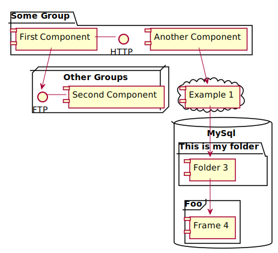图5.1 - 组件图

#### 状态图
@startuml
scale 600 width
[*] -> State1
State1 --> State2 : Succeeded
State1 --> [*] : Aborted
State2 --> State3 : Succeeded
State2 --> [*] : Aborted
state State3 {
  state "Accumulate Enough Data\nLong State Name" as long1
  long1 : Just a test
  [*] --> long1
  long1 --> long1 : New Data
  long1 --> ProcessData : Enough Data
}
State3 --> State3 : Failed
State3 --> [*] : Succeeded / Save Result
State3 --> [*] : Aborted
@enduml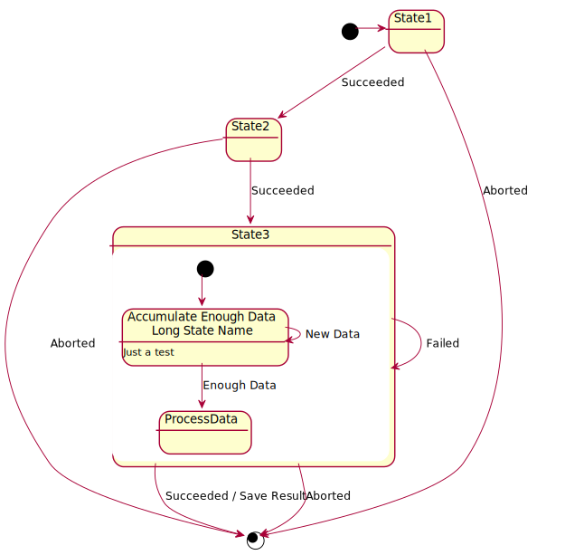图5.2 - 状态图

#### 时序图
@startuml
robust "DNS Resolver" as DNS
robust "Web Browser" as WB
concise "Web User" as WU
@0
WU is Idle
WB is Idle
DNS is Idle
@+100
WU -> WB : URL
WU is Waiting
WB is Processing
@+200
WB is Waiting
WB -> DNS@+50 : Resolve URL
@+100
DNS is Processing
@+300
DNS is Idle
@enduml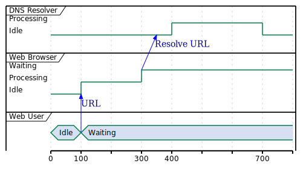图5.3 - 时序图

#### 甘特图
@startgantt
[Prototype design] lasts 13 days and is colored in Lavender/LightBlue
[Test prototype] lasts 9 days and is colored in Coral/Green and starts 3 days after [Prototype design]'s end
[Write tests] lasts 5 days and ends at [Prototype design]'s end
[Hire tests writers] lasts 6 days and ends at [Write tests]'s start
[Init and write tests report] is colored in Coral/Green
[Init and write tests report] starts 1 day before [Test prototype]'s start and ends at [Test prototype]'s end
@endgantt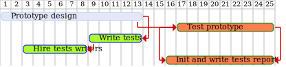图5.4 - 甘特图

#### 思维导图
@startmindmap

+ OS
++ Ubuntu
+++ Linux Mint
+++ Kubuntu
+++ Lubuntu
+++ KDE Neon
++ LMDE
++ SolydXK
++ SteamOS
++ Raspbian
-- Windows 95
-- Windows 98
-- Windows NT
--- Windows 8
--- Windows 10

@endmindmap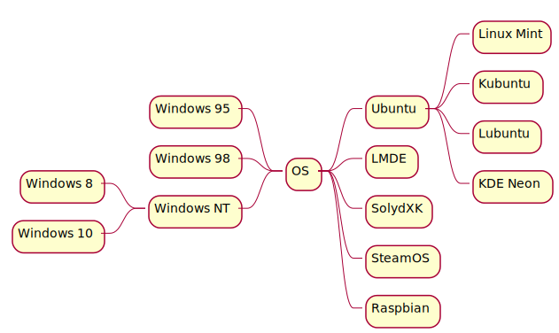图5.5 - 思维导图

