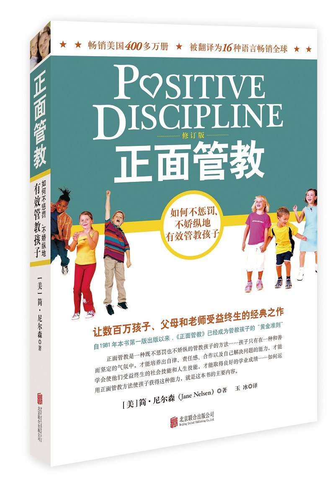

作者：Jane Nelsen

陆陆续续，花了差不多三个多月才读完，非常值得再读第二遍的书。

一个缺乏正确教育的孩子，在个人自省能力被彻底释放之前，其行为、性格和态度等方面或多或少存在不足，甚至有着明显的叛逆和难以管教的问题。在阅读本书的过程中，我不断回忆自己成长的各个画面，仿佛一眼洞穿了当年那个缺乏管教的自己是如何在今天某些方面表现差劲的。

其实，再看看身边的人，那些 90 后 95 后所谓难以管理的年轻人，如果你把他们都当做孩子看待的话，身上似乎都透露着书中提到的各种问题。

这本书的作者提到，不要将本书作为一本技巧书，本书的目的并不是告诉读者如何应对孩子的各种无理取闹，而是通过详细的示范和教学，告诉读者需要正视问题，和善并坚定地，跟孩子一起解决问题。

我家孩子三岁了，每次孩子表现出让人难以理解，而我又制服不了的时候，我就会思考，是不是我对她的了解还不够，我需要通过什么方式去了解更多，最直接的方式莫过于读书，三个月里几乎每次端起这本书都能给我带来新的感悟，有的时候会反思自己对待孩子错误的态度，有的时候在想如何高质量地陪伴孩子，有的时候会照着书上的方法运用在孩子身上。但更多的，还在在阅读和实践的过程中，慢慢体会如何做好一个父亲，学会跟孩子相处，跟她一起成长。

这本书，我还会再仔细阅读第二遍，到时候再来补充更多的感悟。
