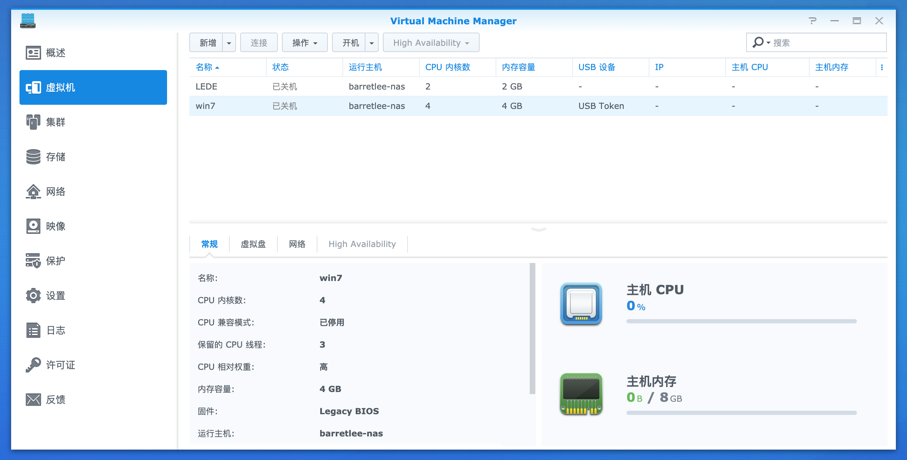
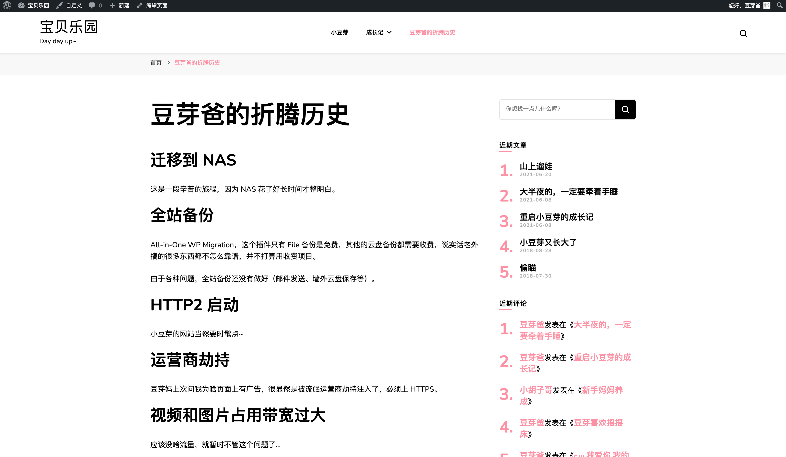

200G 的 iCloud 的储存（21 元/月）已经不够用了，只能升级到 2T（68 元/月），5 年下来价格是 4080 元，也就是 2 块 2T SSD 的价格，想想还不如在家搭建一个 NAS，但是呢，便捷性又不够，还得自己各种折腾，考虑网络、稳定性和数据安全等各种问题。

这是一条来自 2020.09.26 的[微博](https://weibo.com/1812166904/JmsZ4kPAq)，由于家里长期一台配置还比较高的闲置 Mac Pro 挂机，在要不要再搞一台 NAS 这件事情上犹豫了很久，最后决定还是趁着国庆假期折腾一番：

十一假期准备折腾下 NAS，看了一些文章，还是有几个问题想问问有经验的朋友，我的需求大概是这样的：

1. 需要跑 1～3 个虚拟机，Windows 系统和 Linux 系统，预计最低 16G 以上内存才能满足需求
2. 所有的服务都会通过 Docker 镜像提供，CPU 要强一点，有计算类服务
3. 硬盘要求大概是 6T，数据双备份，也就是 18T 要求
4. 支持千兆网络，最好是多网卡

估摸着需要一个可拓展内存位、CPU 较强、盘位多的 NAS，有推荐的选项么，能耗如何？耐久性如何？噪声如何？相比直接一台 MBP（家有闲置） 通过 USB 连大硬盘最大的差异是啥？

## 选购产品

NAS 的全称是 Network attached Storage，网络附属储存，它被创造出来就是为了解决数据储存问题的，围绕数据储存从速度、安全性、性能和能耗等各个方面优化产品，并且针对不同用户场景提供了超级丰富的个性化配置，所以你搜一个群晖，能看到一大堆的型号，玲琅满目。

几乎 90% 的人都建议我不要在 NAS 上跑虚拟机和 Docker，也有同学给出了数据，4c16g 最多也就跑一个虚拟机和十来个 Docker 服务，我找了下群晖的产品，配置达到 4 核 16g 内存的产品，加上几块磁盘，价格随随便便上万，若真的期望储存和 CPU 都满足我的需求，怎么也得 6c32g，光群晖裸机的价格就得一万二，如果再考虑安全性，搞一个 raid5，一万大几的预算就没了。作为玩具，似乎没啥必要，最后退而求其次买了个稍微便宜点的：

倒不是说不建议花一两万，而是有更好的配置方案，让计算跟储存分离，配置一台 2u 的服务器，控制在七千的预算便可以获得 64g 内存以及 i3 甚至更高配的 CPU，然后加一个 4～6 盘位的群晖，价格也能控制到一万以内，如果需求没那么刚，还可以降低配置，将成本控制到七八千。我为了省事儿，也懒得折腾服务器，就选购了8G 内存的 920+，配置了 3 个盘位，足够我用好几年了。

如果是计算和储存分离，我可能会更加倾向 QNAP 了，与群晖相同价格的机器，配置会好不少。从操作系统的体验上，群晖会更加亲民，不过像我这种每天跟命令行打交道的人，UI 就无所谓了。

当然，选择 920+ 和 3 块酷狼盘也是有其他理由的：

大学就吃过硬盘的亏，两个 500G 的硬盘全坏了，现在想想，真的可惜了那上百 G 的种子🦜

所以 NAS 方案，我是肯定不会选 raid 0 的，而 raid 1 最起码得 10T 以上的盘才够用，价格高不说，再多盘位也没用，raid 6 费两块盘，安全性是多了，但是性能也下去了，综合考虑还是选了 raid 5。

raid 5 方案至少需要 3 块盘才能配，群晖的 plus 系列 220+ 和 720+ 就排除了，默认都是两盘位，420+ 可以满足需求，但是考虑到未来磁盘可能不够用的情况，还是选了可拓展的 920+。

红盘的坏盘率有点高，口碑也不好，希捷两类硬盘，酷狼盘和企业盘，后者质保更长，但是噪声略大，最后还是选了 3块 8T 的酷狼，不够了再加。

## 数据方案

NAS 组 raid 5 有不少朋友反馈，风险也挺大的，一般我们的硬盘都是同时间购买，使用寿命也差不多，这就容易在几年后出现多块盘稳定性同时不够的情况，当一块盘坏掉，在利用其它几块盘恢复这块的时候，其它几块盘的负载也就上去了，这个时候很可能出现雪崩问题。

我想了一下，有几个方案可以适当缓解问题，一个是增加盘位，让更多的盘一起扛负载，另外一个就是让盘的大小稍微偏小一些，比如购买 6TB 甚至 4TB 的盘，恢复速度更快。硬盘的寿命一般在 3~5 年，真正能抗 10 年的怕是不多，未来硬盘的价格还会持续下降，每隔 2~3 换一两块磁盘的必要性还是比较大的。

为了兼顾数据的读取速度和稳定性，也考虑到后期增加盘位时硬盘大小不一致带来的浪费问题，给群晖 NAS 配置了 SHR 储存方案。SHR 是对 raid1 和 raid5 的组合实现，详细研究了下这两种储存技术的实现原理：

对于 raid5，了解它可以阅读[这篇文章](https://post.smzdm.com/p/az5005qo/)，本质是利用异或运算做数据的奇偶校验，奇偶检验可以甄别 1 byte 数据的异常问题，它无法具体知道是哪 1 byte，但由于硬盘损坏具备位置确定性，利用这一点就可以很轻松地利用正常数据恢复异常盘位数据了。 raid5 损坏超过两块盘数据就不可恢复来，因此盘位越多，同时损坏多块盘的概率也就越大，可以说 3 块盘的 raid5 安全性从概率上来讲应该是最高的了。

raid1 是数据的 1:1 备份，SHR 是以最小盘容量为基准在做完 raid5 以后，剩下的两块储存会做 raid1，最后一块盘上多出来的空间会废弃。关于 raid1，[这篇文章](https://www.cnblogs.com/ivictor/p/6099807.html)解释的还比较详细，raid1 的特点就是数据写入较慢，比 raid5 要慢很多，但是 raid1 的储存空间在硬盘储存前期是不会被用到的，因为需要先将 raid5 的空间存满。

SHR 虽然可以提升硬盘的空间利用率，但是一旦出故障，恢复起来的难度也会稍微高一些，首先需要找到所有盘上 raid5 和 raid1 的扇区分区位置，然后需要对应地通过不同的算法来恢复数据，当然，成本也不算特别高，至少出现问题，拿着专业的数据恢复工具，我还是有信心可以恢复原始数据的。

我一直担心断电对磁盘和数据一致性的影响，恰巧在购买群晖的第二周，小区断电一次，当时心里慌慌的，感觉弄好的配置啥的会因为断电，导致数据丢失，配置异常，甚至开不了机，大约半小时电力恢复以后，长按开机键，等待绿灯闪烁，打开群晖的 Web 界面，果然……还是自己想多了，一点事儿没有-_-||

## 群晖系统和软件

之前在团队周会分享的时候有详细介绍过对 NAS 的选购、数据方案和软件介绍，但那个时候我对群晖只能说知道个皮毛，也就是把 Virtual Machine 跑了起来，把它当做了一个云盘工具，买回来折腾了三五天以后，就挂机闲置了半年，直到近期在重新整理个人数据的时候，又重新把这个大玩具捡了起来。

群晖的套件中心提供了非常多的应用，基本可以满足日常的数据管理需求：

将内网的服务暴露到公网的方案非常多，路由层可以做，NAS 层也可以做，我使用的是 Dnspod 提供的 DNS 解析服务，以及腾讯云提供的免费 SSL 证书，在云上申请好证书，然后下载下来，在 `控制面板 > 安全性 > 证书` 初可以完成证书的上传和配置。

### MariaDB

在群晖上折腾最多的，还是 SSH 上去后，通过命令行安装软件，如何将服务暴露到外网，就拿 MariaDB 来说，首先需要去 `/var/packages/MariaDB10/etc` 增加 `my.cnf` 文件，并修改配置，
# 默认是 127.0.0.1，也就是只能通过本地环回网络打开
bind-address = 0.0.0.0然后重启应用，
sudo /usr/syno/bin/synopkg restart MariaDB10这个时候就可以在外网直接访问 DB 访问了：
mysql -u root -h nas_domain.com -P 3307在陌生的系统中寻找各种配置真的是一件十分费劲的事情，网上找半天才能找到相关的问题，这里还是比较推荐去 Synology 的官网找资料，十分全面且基本准确。

### VirtualHere

研究 NAS 的时候发现了一个有意思的软件，VirtualHere，通过它可以远程访问安装了 VirtualHere Server 的终端上的所有外接 USB 设备，而本地只需要安装一个 VirtualHere Client 就行了，使用起来十分便捷。其使用效果如同 USB 设备直接插在了本地终端的 USB 接口上，几乎没有区别，IO 速度会受网速影响，但如果是在同一个局域网，影响也是可以忽略的。

其原理是通过串口编程，在 Client 和 Server 之间实现了全部串口通讯协议，通过 Client 将指令传达到 Server 然后转发到 USB 串口。不过这个软件略贵，需要 50 美刀，家里的打印机、扫描仪等任何可以通过 USB 接入的设备都可以直接通过 VirtualHere 接入到网络，然后无缝对接到任何终端（Mac/Linux/Windows）上，就好像这些设备在你身边一样。

对比了下几款同类软件，USB Network Gate 是功能最全面的，但是价格也更高，需要 150 美刀，如果有相似需求，可以尝试下 VirtualHere，在受限情况下（一次只能共享一个 USB）可免费试用 10 天。

稍微研究了下它的签名策略，拿到 VirtualHere Server 所在终端的串口+硬件信息，然后将这些信息提交到它的官网，付完钱会把密钥发到你的邮箱，之后的 Client 和 Server 交互就跟它的官网没啥关系了。也就是说 Server 自己实现了整个解码逻辑。网上搜了下，果然有人把 VirtualHere 的汇编代码搬了出来，注释掉解码的逻辑就可以长期使用了。非完全破解，[仅破解思路文章](http://weibo.cn/sinaurl?toasturl=https%3A%2F%2Fgrimore.org%2Fcracks%2Fvirtualhere_usb%2F3.5.4) ，请购买正版。

### Virtual Machine

如果家里设备比较多，路由器配置又比较一般，在网络流量比较大的时候，很可能会导致整个局域网通讯都处在半瘫痪状态，你可以跑过去重启下路由器，当然也可以考虑换一个一两千的高配路由，我最近还学了个其它的方法，安装软路由来解决问题，大致步骤是：

1. 先电话联系运营商停止光猫的自动拨号，也可以登录到设备自己设置，改成桥接到 ISP 的模式
2. 关闭路由器的自动拨号，相当于让路由变成一个带无线接入能力的交换机，通过 LAN 口接入光猫
3. 在内网一台设备上安装软路由，开启自动拨号和 DHCP，连接到交换机的另一个 LAN 口，此时内网的所有 IP 分配将由软路由接管

可以买一台便宜的工控机专门运行软路由，如果家里有 NAS 的话，也可以将软路由跑在 NAS 上的虚拟机上。

只不过这里有个问题，假设软路由所在机器的网口和交换机（路由器）网口都是千兆，并且你的设备都是通过交换机上网，一旦有终端跑满从交换机到软路由的千兆带宽（高速 BT 或者大文件拷贝），那么其他终端接入网络就会出现塞车问题，怎么解呢？一般工控机和 NAS 都有双网卡，可以考虑再拉一根网线从软路由到交换机，这样软路由就可以输出两千兆的带宽到交换机了。

我在虚拟机上安装了两个系统，一个是 LEDE，另外一个是 Window7。上面说的软路由就是图中安装 LEDE。之所以会安装一个 Win7 系统，是偶尔需要用到招行香港银行的专业版交易工具，它只支持 Windows 系统。Virtual Machine 有一个好处，当你启动好系统以后，可以通过 Web 浏览器远程打开，这对我来说真是太方便了，利用 VirtualHere 还可以将 USB Key 随时分享给远程的 Windows 系统，十分便捷。

唯一的缺点就是 Windows 对内存和 CPU 的消耗太大了，每次为了打开这个远程系统，我都需要先去 NAS 上关闭几个略占内存的应用，比如 Plex、Docker-gitlab 等等。

### WordPress

之所以近期去折腾 NAS，也是想起来之前给孩子记录生活的博客系统，由于之前在阿里云购买的机器到期未续费，博客停更了两年，看到群晖上可以部署 Nginx 和 Apache，认认真真的折腾了好几个晚上，把几乎所有你想得到的和想不到的坑都踩完了，然后把之前的那份 `wordpress.tar.gz` 重新部署到了私有数据中心：

目前运行起来还是非常稳定的，修复了几个 WordPress 发布慢的 bug。

## 小记

关于系统和软件部分，省略了几万字，折腾的过程中遇到的问题非常多，但大多数都是命令行操作时遇到的，为了让所有对外的服务都是 HTTPS 的，并且增加几道安全防火墙，不得不把系统研究得透透的。

总的来说，目前的 NAS 已经可以满足我的基本需要和进阶需要了，而且在折腾和学习的过程中，还养成了把自己做的各种程序封装成 Docker 应用的习惯，也摸索了一些比较有意思的实践，后续有空可以聊聊，今天先到这里。
