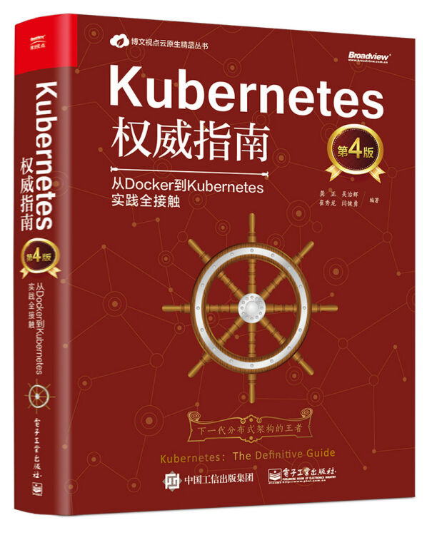

最近花了不少时间把《Kubernetes 权威指南》这本厚达 800 页的书翻完了，这是一本工程实践 + API 说明书，代码和接口描述估计就占了 400+ 页，综合评分三颗星吧，唯一读起来有点意思的是第七章网络原理。

这本书买了有段时间了，一直放在家里吃灰，在折腾 NAS 的时候为了方便管理 Docker，想部署一个 Kubernetes，再加上自己做的业务迁移在云上容器跑了半年多了，很多问题一直是一知半解的，本着吃透相关知识的精神翻开了这本厚厚的书。

## k8s 分布式架构

Kubernetes 具备完备的集群管理能力，包括多层级的安全防护和准入机制、多租户应用支撑能力、透明的服务注册和服务发现机制、内建的智能负载均衡器、强大的故障发现和自我修复能力、服务滚动升级和在线扩容能力、可拓展的资源自动调度机制，以及多粒度的资源配额管理能力。
局域网内四台物理机，一台作为 k8s 的 Master Node，另外三台作为 Worker Node，所在网段为 192.168.1.0/24，每个 Node 中部署的 Pod 规划的网段是 10.1.0.0/16。

Master Node 和 Worker Node 是怎么产生的呢？可以通过 `kubeadm` 这个工具安装：
# 在一个节点上执行如下指令，让节点成为 Master
sudo kubeadm init --pod-network-cidr 10.1.0.0/16

# 此时会生成一个邀请指令，在其他节点上执行如下指令，会将自己视为 Worker Node 加入到 k8s 集群
kubeadm join 192.168.31.165:6443 --token t6tev0.nkzr4gy05kn4ht01无论是 Master Node 还是 Worker Node，上面都会运行着一个 kubelet 程序，它的作用是启动和停止容器的组件，我们称之为 Container Runtime，比较知名的就是 Docker 了。为了更具扩展性，Kubernetes v1.5 引入了 Container Runtime Interface（简称 CRI），这一规范化操作避免了各种 Runtime 的野蛮生长，让开发者可以专注于容器运行时本身。

当我们初始化一个 k8s 集群的时候，集群会运行几个控制平面组件，包括 kube-apiserver、kube-controller-manager、kube-scheduler、etcd 等，Kubernetes API Server 的核心功能是提供 Kubernetes 各类资源对象的 CURD，包括 Watch 和 HTTP Restful Interface，它是集群内各个功能模块之间数据交互和通信的中心枢纽，是整个系统的数据总线和数据中心；etcd 是个持久化储存的 KV Store，它提供的 Watch API 保障了整个集群各类事件的及时响应和快速处理。
Kubernetes Controller Manager 是一个中控组件，能够在集群中感知异常或状态变化，并及时自动化修复和完善，比如 Node 意外宕机、某个服务设定的 3 个 Pod 副本变成了 2 个等等它都会主动处理；与之并重的另外一个组件是 Kubernetes Scheduler，它的作用是将待调度的 Pod 通过一些复杂的调度流程计算出最佳目标节点；而 Kubernetes Node 也即 kubelet，是一个执行器，它负责将上游传递过来的 CURD Pod 指令执行下去，同时会不断向 API Server 报告自己的情况，方便给 Controller Manager、Scheduler 以及集群内的其他组件做决策。

## 服务创建和发布

在 Kubernetes 中，Service 是分布式集群架构的核心，它是对一组 Pod 的抽象，会根据负载均衡策略来访问这组 Pod，从功能上看，Service 就像是一个反向代理，只不过这个反向代理会被 Kubernetes 统一自动管理。Service 在 Node 中由 kube-proxy 进程来实现的，这个进程可以理解成 Service 的透明代理兼负载均衡器，其核心功能就是将某个 Service 的访问请求转发到后端的多个 Pod 实例上。
当集群中 Service 或者 Pod 发生变化的时候，所有的信息会被同步到 API Server 的 Endpoints Controller，然后将事件同步到各个节点的 kube-proxy 程序，程序会自动修改节点中对应 Service 的 iptables 信息。

服务的发布方式有[多种](https://kubernetes.io/zh/docs/concepts/services-networking/service/#proxy-mode-iptables)，可以是 ClusterIP 仅集群内访问，也可以是 NodePort 允许外部访问，上图所示将服务通过 NodePort 暴露，所有的流量会经过 NodePort，然后走 iptables 策略选择最终的 Pod，进入 Node 后进行一次 DNAT 将流量发到目标 Pod。
