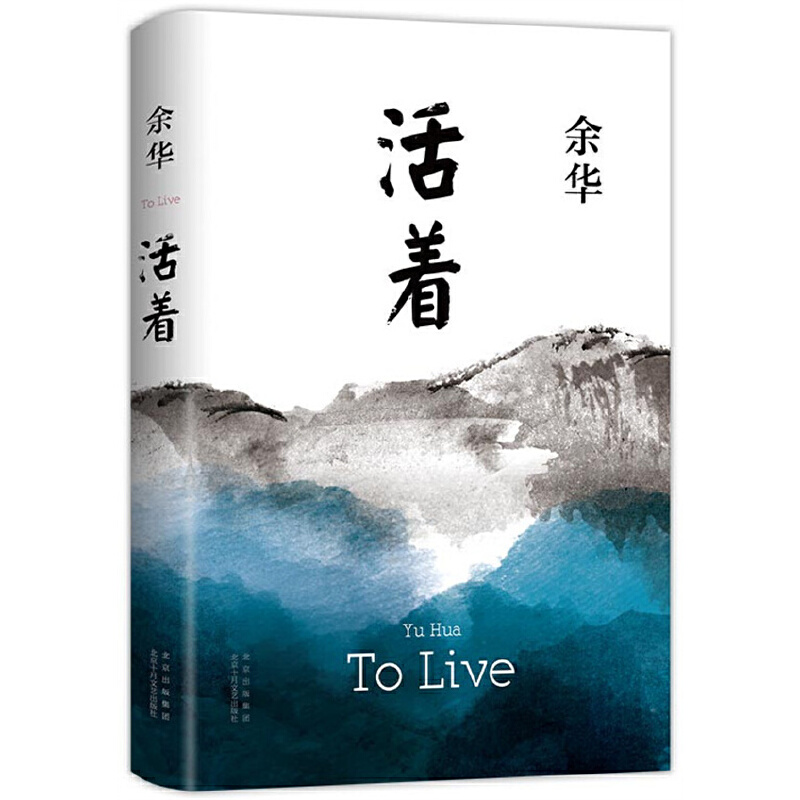

作者：余华

富贵这名字取的是真不错，地主家的儿子，败光了家产，一夜之间变成贫农，从此开启了穷困潦倒的生活。日子从来都不是那么好过，跟人斗、跟生活斗、跟命运斗，最终还是没能斗过这难缠的岁月。

活着，或是一件再简单不过是的事情了，但是在富贵身上，与其说活着，还不如说熬着，日子总是熬才能过去，把一个大少爷磨成了地里耕地的驴子，把一个人对人生的希望都磨灭成了灰烬。每一刻都是如履针毡，每一秒都是带血的辛酸。

富贵的人生局限在所处时代，无可厚非，他也只是社会的一缕缩影，微不足道。但同时，恰恰也是这一缕又一缕的微不足道，构成了那个惨淡、昏暗的时代，挣扎亦是徒劳的。

