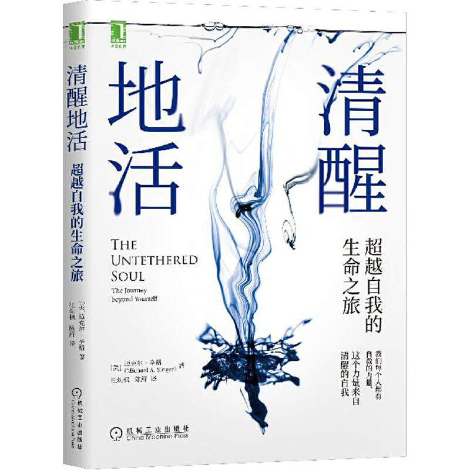

作者：迈克尔·辛格

以前写过一篇文章《[一切都是最好的安排](https://www.yuque.com/barretlee/thinking/uph8bv)》，结合最近在看的这本书，弄明白了，为啥之前的“这种感觉”不见了——刚才的焦躁是一种情绪，我被焦躁的情绪给带走了，我成了焦躁的我，而在听到孩子妈妈那段话之后，我觉知到了这个焦躁的我，回到了观察者的角色，回到了居中的位置，回到了本我。

回到本我之后，我回到了主体的角色，焦躁是一种内心的情绪，他是客体，焦躁的情绪不是我，就好比我去看一张桌子，桌子是客体，我是主体，焦躁的情绪跟桌子一样，他们只是沧海之一粟，在我的眼前，来了又走，走了可能还会来，只要不让他住进自己的内心，不把本我带走，他就会很快地走。

学会放手，才能得到更多快乐和自由。

以下是书评和书摘：

真实。不过价值也不是这么计算的，如果一个巨型产品真的可以让所有用户多逗留一分钟，这个牛皮可以吹很多年了。
五年之前，我还是一个产品经理，供职于一家飞速发展的互联网公司。每天我都忙于设计各种吸引用户注意力的功能，只为让人们可以在千变万化的数字世界里多停留一会儿。
故事的转折出现在某个清晨，我从床上醒来，一个声音在我脑海里浮现：我每天全部的时间只是为了让用户多停留一分钟吗？这是我所期待的生活吗？这是我真实的样子吗？

**第一部分 觉醒中的意识**

对真正的成长而言，最重要的是要认识到你并不是脑海中的声音，而是这个声音的倾听者。如果你不明白这一点，你就会纠结于无数的声音中究竟哪一个才是你。人们以“试图找到自己”的名义不断改变自己，想要发现在这无数的声音中，在他们的种种个性里，哪一个才是真正的自己。答案很简单：全都不是。

如果你客观地观察，你会发现当内心积聚了紧张、畏惧或基于欲望的种种能量，脑海中的声音就会变得异常活跃。

如果你不能把世界变成你喜欢的样子，你的内心就会用言语表达、判断、抱怨，然后决定要对它做什么。这会使你觉得自己更有力量。

**第2章 内心深处的室友**

必须打破一种思维习惯，即认为解决问题的办法在于重新安排外部事物。要永久性地解决你的问题，唯一的办法就是深入你的内心，让似乎总是与现实格格不入的那一部分的你得到解脱。

要做到这一点，你就得在自己清醒的时候设定人生方向，不要让摇摆不定的思想阻碍你。你的意志力要比聆听那个声音的习惯更强大。没有什么是你做不到的。你的意志凌驾于这一切之上。

**第3章 你是谁**

如果你是正在观看某个事物的主体，那么这个事物就不是你。所以你可以立刻知道你不是外部世界。你是正从内心深处向外观看着世界的人。
**第4章 清醒的自我**

要进行最深层次的冥想，你不仅必须有能力将你的意识完全集中在一个客体上，你还必须有能力使觉知本身成为那个客体。在最深层次的冥想中，意识的焦点会回归“自我”

**第二部分 体验能量**

创造想法、保持想法、回忆想法、产生情感、控制情感，以及控制强大的内在本能需求，都需要消耗巨大的能量。

你无法时刻感觉到这种能量的唯一原因就是你封闭了它。你关闭自己的心灵，关闭自己的思想，把自己拖进了一个限制性的内心空间，从而封闭了自己。这也切断了你与所有能量的联系。当你关闭你的心灵或思想时，你只能躲藏在自己内心的黑暗中。那里没有光，没有能量，没有任何事物在流动。能量依然存在，但它无法进入。

能量不会衰老，不会疲倦，也不需要食物。它需要的是开放和接受的心态。每个人都平等地拥有这种能量。

例如，你可能对他人怀有潜在的恐惧，当你接触到他人时，往往会关闭自己。事实上，只要有人向你走过来，你就可能产生一种紧张得想缩起来的感觉。你可以训练自己去做相反的事。每当你看到他人，你可以训练自己敞开自己。

任何时候当你开始关闭自己，就问问自己是否真的想切断能量流。因为只要你愿意，你就可以学会保持开放，不管这个世界上发生了什么。你只需要承诺去探索自己接受无限能量的能力，并下定决心不关闭自己。

你将会发现，你人生中唯一真正想要的是感受热情、喜悦和爱。如果你一直都能感受到这些，那么还用在乎外界发生了什么吗？如果你总是感到精神振奋，如果你总能为当下的体验兴奋不已，那么体验本身是什么就不重要了。无论你面临什么体验，当你的内心拥有美好的感觉时，这种体验就是美好的。所以无论发生了什么，你都要学会保持开放。这样一来，你就能免费得到别人需要拼命追求的东西：爱、热情、兴奋和活力。你需要认识到，定义能使你保持开放的条件，最终会限制住你。一旦你列出为了让你开放自己，世界必须变成什么样的清单，你就将自己的开放置于那些条件的限制下了。最好的做法是，不管怎样，都保持开放。

不要让人生中出现的任何事物变得太过重要，以至于你愿意为之关闭自己的心灵。当你的心灵开始关闭时，你只需说：“不，我不会关闭自己。我要放松。我会让这一情况发生，然后面对它。”你要尊重并重视这一情况，然后无论如何，尽你所能地应对它。而且你要以开放的态度应对它，拿出兴奋和热情应对它。不管发生了什么情况，就让它成为今天的乐趣吧。

通过冥想、觉知和特意的努力，你可以学会使你的能量中心保持开放。而要做到这一点，你只需要放松和释放。不要相信世界上有任何事物值得你为之关闭自己。记住，如果你热爱生活，就没有任何事物值得你为之关闭自己。事实上，世界上从来就没有任何事物值得你为之关闭自己的心灵。

**第6章 心灵的秘密**

事实上，你并不是你的心灵。你只是你心灵的体验者。

活着的意义在于体验你正在经历的那个时刻，再体验下一个时刻，接着是再下一个

想象一下，如果你在人生的每一次体验中都能这样充分投入，让你的体验深深地触动你的存在，那么人生的每一刻都将是一次激发你、感动你的体验，因为你会完全开放自己，生命将畅通无阻地在你身上流淌。

从长远来看，那些无法从你这里通过的能量会被推到你心灵和思想的最前沿，并且一直待在那里，直到你准备好释放它们。

**这种未释放的能量不要太多**
业力是一种障碍，是某个来自过去的印象，是未能通过的能量，最终将主导你的生活。

这种能量循环的过程正是“业力”所导致的。业力是过去储存的能量在相对平衡状态下的循环。正是你对体验这些能量的抗拒导致了能量围绕自身循环。它没有其他地方可去，而你又不肯对它放手。

依恋会产生积极的业力，当这些业力被激活时，它们会释放出积极的能量。因此，有两种体验可能阻塞你的心灵：你要么因为被某种能量困扰而试图将它们赶走，要么因为喜欢某种能量而试图将它们留在近旁。在这两种情况下，你都没有让它们通过，你是在通过抗拒和依恋来阻止能量流动，从而浪费了宝贵的能量

这个长久以来一直储存在心里的业力能有机会通过你，你要为之高兴。你只需要敞开胸怀，放松心灵，原谅，大笑，或是做任何你想做的事。但切勿再次压抑它。当然，它的出现会带来痛苦。它是与痛苦一同被储存的，也会与痛苦一同被释放。你必须做出决定，是带着累积的痛苦继续活下去，使它能够继续阻塞你的心灵并限制你的人生；还是在它被激活时顺势放手，痛苦一分钟，然后结束这一切。

**第7章 超越自我封闭的倾向**

由于你自身没有任何一部分是你不愿意看到的，你的头脑不会再被分为意识和潜意识。你在内在世界中看到的一切都只是你在内在世界中看到的某个事物而已。它并不是你，而是你所看到的事物。那里有你内心涌出的纯净能量，产生了思想和情感的涟漪；那里还有觉知到这一切的意识。这一切都只不过是你在观看内心的舞蹈罢了。

只管做自己的事，把你的全部身心都投入到正在发生的事情中去，而不是把你的全部身心都投入到个人的敏感多虑中去。

停下”到底是什么意思？它是你需要在内心中做的一件事，也就是放手。当你放手的时候，你就不会被卷入正试图把你拉进去的能量

**让意识停留在内心深处，而不是附着在其他客体上，包括思绪和情感，一些都不是自我，关注他们都无法居正。**
当内在能量开始流动时，你不必跟着它们走。比如，当你开始思考时，你不必跟着你的思绪走。假设你在外面散步，一辆车从你身边驶过。你的想法是：“天哪，真希望那辆车是我的。”你继续散步，但是你开始变得不安。你想要一辆那样的车，但是你的薪水不够高。于是你开始考虑如何获得加薪或是换一份工作。但实际上你没有必要考虑这些。事情可以只是——车来了，车又走了，想法来了，想法又走了。车和想法一同消失了，因为你没有跟着它们走。这就是所谓的保持居中。
如果你不保持居中，你的意识就会跟着它注意到的任何事物走。看到汽车驶过，你就会走神，开始想关于汽车的一些事情。看到一条船，你又会满脑子都是船，而把汽车忘得一干二净。这样的人确实存在。他们做不好自己的工作，人际关系也一塌糊涂。他们会把很多事情搞得一团糟；他们的能量也被分散得七零八落。

**如何做到？就是放下，把注意力从刚才的主体拉回来，回到客体，回到想去关注的主体，回到放下。如果放不下，就忍受这种痛苦，告诉自己可以接受，直到放下。**
当内在能量开始流动时，你不必跟着它们走。比如，当你开始思考时，你不必跟着你的思绪走。假设你在外面散步，一辆车从你身边驶过。你的想法是：“天哪，真希望那辆车是我的。”你继续散步，但是你开始变得不安。你想要一辆那样的车，但是你的薪水不够高。于是你开始考虑如何获得加薪或是换一份工作。但实际上你没有必要考虑这些。事情可以只是——车来了，车又走了，想法来了，想法又走了。车和想法一同消失了，因为你没有跟着它们走。这就是所谓的保持居中。

如果你不保持居中，你的意识就会跟着它注意到的任何事物走。看到汽车驶过，你就会走神，开始想关于汽车的一些事情。看到一条船，你又会满脑子都是船，而把汽车忘得一干二净。这样的人确实存在。他们做不好自己的工作，人际关系也一塌糊涂。他们会把很多事情搞得一团糟；他们的能量也被分散得七零八落。

**做到这一点并不容易，需要长年累月的持续训练，我们很容易被情绪左右，更容易陷入到思想的迷雾之中。**
你有能力不去跟随任何想法。你可以坐在意识的位置上，然后放手。一种思想或情感出现，你注意到它，然后它就可以过去了，只要你允许它通过。这是一种解放自我的技巧，要做到它只需理解思想和情感仅仅是意识的对象。当你看到你的心灵开始焦虑时，你显然已觉知到这一体验。但觉知者是谁？是意识，是内在的存在，是灵魂，是自我。它是观者，是那个“看”的人。

**失去了居正，意识脱离本位。**
除非你离开了意识的中心，跟随它们而去。

比方说，你感觉有一些嫉妒或恐惧。如果你专注于这一情绪，它就会变得越来越重要，要求你给予更多的关注。然后，由于你的关注会滋养它，它会被注入更多的能量，从而吸引更多的注意力。这是一个循环的过程。最终，起初只是一闪而过的思想或情感会成为你整个生命的中心。如果你不放手，它就可能完全失控。

**对能量放手，就是居正，做好观察者，没有任何思考，只是观察，然后放下，不被带走。**
如果你能对能量放手，你就真的自由了，尽管总有一些事情在所难免。

**按照前文所述，这里用“夺走”这个词并不准确。意识会因为能量的牵引被带走，然后跟随着情绪、思想飘向远方，意识的宝座永远都在那里，就等着它回来，继续做一个观察者，而不是参与者、体验者、思考者。**
没有什么能够夺走你的意识宝座。

**第三部分 自我解放**

我们所有人都必须面对这样一个事实：变化是生命的本质。如果你很恐惧变化，你就不会喜欢变化，你会努力在自己周围营造一个可预测、可控制、可定义的世界，创造一个不会激发你的恐惧感的世界。恐惧并不想感受自己；事实上它很害怕自己。所以你企图运用思想来操纵生活，为的是不感觉到恐惧。

那些压抑你的想法会时不时地抬头。每到这个时候，你就应该放手。你只需允许痛苦进入你的心灵，然后从那里通过。如果你这样做，它就会过去。如果你在真诚地寻求真理，那么你每次都会选择放手。放手这一过程的起点和终点是你让自己完全投入到清空自己的过程中。当你努力这么做时，你将开始了解放手过程中的各种微妙定律。

让我们来一步步地分析这种坠落。当你被拖进混乱的能量场中时，坠落就开始了。你最终将掉到你不该去的地方。那下面是你最不希望意识落入的地方，但它正是要被拖到那里去。现在，当你透过被扰乱的能量向外看时，一切都被干扰产生的阴霾扭曲了。原先看起来很美的事物，现在看起来却很丑陋。原先你喜欢的事物，现在看起来却阴暗而压抑。但是其实并没有什么真正发生了改变，只是你是在从那个混乱的位置看待生活罢了。

想象一下，当你在被扰乱的能量中迷失时，你实际上会做一件或多件你的大脑让你做的事情。想象一下，如果你真的辞职，或者你认定“我已经忍得够久了，我要向他表明不满”，会发生什么事情。你根本不知道这是向下迈了多么大的一步。你的内心发生扰动是一回事，可一旦你允许它表达出来，一旦你开始让你的能量摆布你的身体，你就已经降到了另一个层次。此时你几乎已经不可能放手了。如果你开始对某人大喊大叫，如果你真的在这种不清醒的状态下告诉某人你对他的感觉，那么你就已经把那个人的心灵和思想牵扯到你的想法中了。现在你们两个人的自我都被牵扯进来了。一旦你把这些能量表露出来，你就会想为自己的行为辩护，让它们看起来恰如其分，但对方永远不会认为它们恰如其分。

不管你的下方发生了什么，你的眼睛要向上看，心灵要放松。你不必为了应对黑暗而离开自我的座位。只要你允许，你的心灵会自我净化。卷入黑暗之中并不能驱散黑暗，只会滋养黑暗，所以千万别转向黑暗。如果你发现你的内心中有被扰乱的能量，没关系。不要以为你已经没有阻塞物需要释放了。你要稳居觉知的位置，绝不能离开。不管发生了什么，开放心灵，让它过去。你的心灵会变得纯洁，你将再也不会经历另一次坠落。

**第10章 为你的心灵窃取自由**

疼痛不是坏事，它是身体和你说话的方式。当你吃得过多时，你会胃痛；当你的手臂承受的压力过大时，它也会开始痛。身体通过它的通用语言——疼痛来进行交流，你的内心则通过它的通用语言——恐惧来进行交流。害羞、嫉妒、不安全感、焦虑都是恐惧的表现。

你能想象吗？大脑必须努力将你所说的每一句话都以正确的方式表达出来，让别人用正确的方式接受它们，并且让它们对每个人都产生正确的影响。它必须确保你所做的每一件事都被正确地诠释和看待，并且没有人会做任何伤害你的事。它必须确保你得到你想要的一切，并且你永远也不会遭遇你不想要的事物。大脑一直在试图向你建议如何让一切都好起来，这就是为什么大脑会如此活跃——因为你交给了它一个不可能完成的任务，相当于指望你的身体拔起树木和一步跳过一座大山。如果你一直拼命让身体做它做不到的事情，它是会生病的。心理崩溃也是这个道理。身体崩溃的前兆是疼痛和虚弱感，心理崩溃的前兆则是潜在的恐惧和持续不断的神经质思维。

你获得晋升之后，它是否让你的所有不安全感消失，并能让你在余生中实现经济上的满足？当然不是。唯一的结局就是下一个问题又浮出了水面。
一旦你看到了这一点，你就会认识到大脑存在着一个潜在的严重问题：它所做的只是营造可能使情况变得更令人舒适的外部环境而已。但外部环境并不是导致内部问题的原因，改变外部环境仅仅是解决问题的一种尝试。例如，如果你的内心存在孤独感和缺失感，那么这并不是因为你还没有建立起某种特殊的关系。后者并不是问题的诱因。建立关系只是你解决问题的尝试。你所做的只不过是想看看这种关系能否平息你内心的不安。如果不能，你就将尝试其他办法。
但事实是，外部变化无法解决你的问题，因为它们无法解决问题的根源。问题的根源在于，你在内心深处觉得自己不圆满、不完整。如果你不能正确识别问题根源，你就会去寻找某人或某事来掩盖它。你将躲藏在财富、人物、名誉、崇拜后面。如果你试图找到一个合适的人来爱你、崇拜你，并且也成功了，那么你实际上是失败了。你没有解决你的问题，你所做的就是把那个人也卷入你的问题中。这就是为什么人们会在人际关系上遇到那么多麻烦。一开始你自己的内心出现了一个问题，然后你试图通过和别人交往来解决这个问题。这段关系会出现问题，正是因为是你的问题导致了这段关系的缔结。一旦你退后一步，敢于诚实地看待这段关系，就很容易看明白这一点。

目前，你和你的心理之间的关系就像是一种成瘾症。它不断地向你提出要求，而你则不得不把你的人生奉献出来，去满足这些要求。如果你想获得自由，你就必须学会像对待其他成瘾症一样对待它。例如，吸毒者有能力参加戒毒，停止吸毒，以后再也不吸毒。也许这并不容易，但他们的确有能力这么做。心理上的成瘾症也是如此。聆听自己没完没了的心理问题是一件很荒谬的事，你有能力终止它。你可以在早晨醒来，对接下来的一天充满期待，而不去担心会发生什么。你的日常生活可以像度假一样。工作可以是有趣的，家庭生活可以是有趣的，你可以享受这一切。这并不意味着你没有全力以赴，你只不过是在快乐地全力以赴而已。然后，晚上睡觉时，你会让一切都过去。你不会因为生活而紧张担心。你实际上是在过生活，而不是害怕生活或是与它做斗争。

**第11章 痛苦是自由的代价**

让我们看一看这些敏感层是怎样被构造起来的。为了避免遭拒的痛苦，你努力维护友谊。由于你清楚自己被拒绝，甚至是被朋友拒绝可能性，你会更加努力地避免被拒绝。为了实现这一愿望，你必须确保你做的每件事都能被别人接受。这就决定了你的穿着和行为方式。注意，你不再直接关注拒绝本身，你转而关注你的衣服，你的走路方式，或者你开的车。你距离核心痛苦又远了一层。

你必须再深入一点，看看敏感层之间是怎样相互作用的。痛苦位于核心位置。然后，为了逃避痛苦，你忙于尽量和朋友待在一起，隐藏在他们对你的接受之中。这是核心以外的第一层。接着，为了保证朋友接受你，你力图以某种方式展示自己，以赢得朋友并影响他人。这是核心以外的第二层。每一层都附着在原来的痛苦上，这就是简单的日常互动会对你产生如此巨大的影响的原因。

当你处理一件事情，抵抗它引起的痛苦时，你将不得不调整你的行为和思想，以保护自己。你必须这样做，这样才不会使你内心对这件事的看法恶化。你最终会在被封闭的能量周围建立起一个完整的保护结构。如果你能清楚地看到这一切的发生，并理解其长远影响，你就会想摆脱这个陷阱。然而，除非你愿意释放最初的痛苦而不是躲避它，否则你将永远不会自由。你必须学会超越那种逃避痛苦的倾向。

**第13章 远远超越**

“超越”一词指明了心灵成长的真正方向。超越的最基本意义是越过你的所在，不要停留在你目前的状态下。当你不断超越自己，就不再有任何限制和界限。限制和界限只存在于你停止超越的地方。如果你永不停止，你总会超越界限，超越限制，超越自我限制的感觉。

从前，如果要把狗关在后院，你必须装上篱笆。如今你不需要篱笆了，因为你可以使用电子设备。你可以把电线埋在地下，再给狗套上一个小项圈。狗会想：“我自由了！我以前必须待在篱笆里面。太好了！”当它跑向不该去的地方，“嚓！”——它往后一跳，叫了起来。原来，那里有一条无形的边界，当狗靠近那条边界，就会被电击一次。电击令狗感到很疼，非常不舒服，所以后来只要狗走近边界，它就会害怕。所以你看，笼子不一定要看起来像笼子，也可以是由你对不舒适的恐惧制造的。如果只要你走近边界，你就会开始感到不适和不安，那么边界就是你的笼子的铁条。只要你待在笼子里，你就不可能知道外界是什么样子。笼子的边界使你的世界看起来有限而短暂，而无限和永恒就在你的笼子外面。

**第14章 抛开虚假的坚实**

如果你探索意识，即你的纯粹觉知，你会发现它其实并不存在于空间的任何一点上。它是一个觉知场，通过专注于某一组对象而聚焦到某一点。你可以只觉知一根手指，也可以觉知整个身体。你可以完全迷失在一个思想里，也可以同时觉知你的思想、情感、身体和周围环境。意识是一个动态的觉知场，它有能力聚焦于一点，也能够广泛扩展。当意识聚焦得足够集中时，它就失去了广义自我。它不再把自身作为一个纯粹的意识场来经历，而是更多地把自己与它所关注的事物相联系。正如我们所见，当你非常专心地看电影时，你会完全失去坐在寒冷黑暗的影院里的广义感觉。你的专注点已经从身体和周围环境转移到那部电影的世界里，你实际上已经迷失在这段经历里。这种情况可以推及你的整个人生经历。你的自我感取决于你意识的关注点。

要通过放弃执着来做到这一点，而不是通过用思想建造虚假的坚实。你只是做出最终的决定，要通过不断放手来完成此次旅程。

**第16章不抵抗的心灵成长之路**

当自我的力量被集中起来并被引向肉体、精神和情感领域时，会产生一股力量，我们称之为“意志”。

毫无疑问，我们在抵抗现实。比如，有人说了我们不喜欢的话，显然我们的抵抗并不能使他们已经说出的话消失。我们实际上想阻止这件事情从我们这里通过，我们不希望它影响我们的内心。我们知道它将留下精神和情感的印象，而这些印象并不符合内心已有的模型。所以我们针对事件的影响施加意志力，想要阻止它通过我们的心灵和思想。换言之，对一件事的经历并不止于我们对它的感官观察，事件还必须在能量层面通过心灵，这是我们每天都会经历的过程。

比方说，你怕狗，但当你意识到别人一生都不会怕狗，你却必须一辈子承受怕狗的痛苦，你开始觉得这种痛苦没有意义，所以你决心学习在看见狗时克服恐惧，放松心情。与抵抗合作的方法就是放松。在个人抵抗中放松的行为不仅会改变你与狗的关系，还会改变你和所有事物的关系。你的灵魂现在已经学会如何让扰动性的能量通过。下一次再有人说或做你不喜欢的事情，你会自动地像处理对狗的恐惧那样处理此事。这种在抵抗中放松的行为对你生活中的每一件事都有利，这是因为它能直接解决一个问题，即当你的心想要关闭时，怎样让它保持开放。

在这之前，你只需要认识到生活正给予你一个礼物，这个礼物就是从你出生到去世流过你的所有事件。这些事件令人激动，具有挑战性，并会给你带来巨大的成长。要自如地应对这股生活事件流，你的心灵和思想就必须开放和扩展得足够大，能够包容现实。你做不到的唯一原因是你在抵抗。学会停止抵抗现实，那么原先看似紧张的问题将会变成你灵性之旅的踏脚石。

**第17章 思考死亡**

学会每时每刻都好像在面对死亡，你就会变得更大胆、更开放。如果你生活得充实，你就不会有什么最后的愿望，因此你每一刻都亲历着它们。只有这样，你才能充分经历生活，释放害怕经历生活的那部分你。你没有理由害怕生活。一旦你明白你唯一能从生活中得到的东西就是经历生活时的成长，恐惧就会消退。生活本身就是你的事业，你与生活的互动是你拥有的最有意义的关系。你所做的其他一切事情都只专注于生活的一小部分，试图赋予生活一些意义。而真正赋予生活意义的是乐于亲历生活。这不是什么特别的事情，而是要乐于体验生活中的事情。

不过，你很快就会发现这不是你真正想要的答案。你必须明白，正是因为你试图从生活中获得特殊的体验，你才会错过生活的实际体验。生活不是你得到的东西，而是你经历的东西。无论有没有你，生活都是存在的，它已经持续了亿万年，你只是有幸看到了它极其微小的一部分。如果你忙于得到什么，你就会错过你正在经历的那微小的一部分。

你开车从这里驶向那里，却什么也没看见。你的心思不在这里。你正忙着想下一步要做什么，你总是提早一个月甚至一年做计划。你不是在度过生活，你是在度过你的思维过程。所以是你，而不是死亡，抛弃了你的生命。

在死亡之前，你真的不需要更多的时间；你需要的是在你所拥有的时间里拥有更深层的经历。

