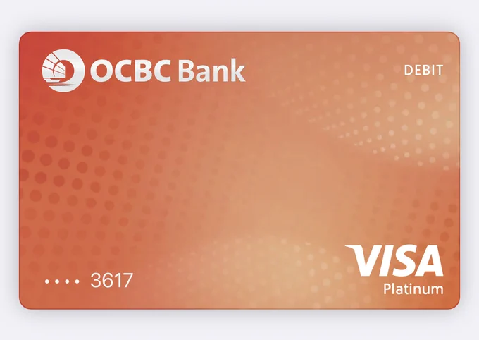

最近看到好多人推荐开通新加坡华侨银行 OCBC，这是我目前为止看到唯一一个，使用全部大陆身份信息就可以安全开通且没啥后顾之忧的境外银行卡，之前尝试开通 Wise，获得了一张英国 Visa 卡，但没有英国境外地址一直让我担忧被风控，而 ZA Bank 需要肉身去香港才能开通，因为它要求你提供出境记录，而且本质还是一张虚拟卡。

## 境外银行卡

如果你平时炒美股或者港股，此刻手里头肯定已经有了一张境外银行卡，至少香港卡是有一张的，几乎所有的美股港股的证券入金都要求你使用境外银行卡。我手里头就有一张招行香港一卡通，办了差不多十年了，这张卡有两个毛病，一是不能线上消费，它没有 CVV（Card Verification Value），例如给 Github 续费，购买 Twitter 会员等，这张卡就使不上劲，另外一个问题是管理费较高，其实大多数的境外卡都是有管理费的，如果卡里钱比较少的话，它的扣费就比较恐怖了，这是官方客服的回复：

> 账户管理费收费标准：每月5号扣款，扣款当月审核前3个月日均资产
> - 前3个月日均资产达到等值10万港币及以上不收；
> - 前3个月日均资产在等值5000港币至10万港币之间，每月50港币，电子账单优惠至10港币每月；
> - 前3个月日均资产低于等值5000港币，每月150港币，电子账单优惠至100港币每月

所以简单来说，如果你有海外的购物、消费场景，或者有炒股需求，搞一张具有 CVV 的银行卡（信用卡、储蓄卡都可）是不可避免的。香港很多银行的卡片在大陆就可以办理，例如民生香港、汇丰香港等，不过他们都有一定的门槛，要求你在卡里存 10w~30w，放一到三个月，或者购买他们的投资理财产品才允许申请，还得去网点柜台。

那有没有低管理费，又可以方便快捷办理的境外银行卡呢？其实还挺多的，本文要介绍的就是新加坡华侨银行，OCBC。

## OCBC 的在线开通和踩坑记录

OCBC 是新加坡第二大行，完全有保障，其账户的开通全程都可以使用大陆 IP 操作，还是比较便捷的。我按照网上的教程走了一遍流程，已经成功开通，简单介绍下踩过的几个坑：

1）使用 OCBC Digital 这个 APP 就可以完成开通，过程中它会要求你使用手机的 NFC 功能扫描护照芯片信息，**所以你的护照本、身份证要准备好；申请时需要注意，公众人物要填否、是否自雇要填否，另外你的大陆税号就是你的身份证号**。我遇到的两个坑：刚开始税号填的是无，结果一周后审批没通过，审批失败它不会告诉你任何原因，你得自己斟酌；申请通过后还需要做一次 kyc 认证，我认证了十几次才通过，原因是减肥以后长相发生了变化，后来找到一个技巧，拍照的时候手机稍微倾斜可以显得我的脸比较大，更容易通过😅

2）申请完成后会获得两个账户，一个是新币种账户 SSA，一个是多币种账户 GSA，在半年内入金 1000 新币就可以激活账户；**关于入金，国内的工行、招行等软件上都有跨境汇款入口，可以将你的人民币兑换成新币现汇，然后走跨境汇款转入 OCBC 账户即可，一般一两天可以到账**；我是先通过香港银行转 Wise，然后使用 Wise 转 OCBC 完成的激活，手续费 20 美金，耗时四五天，如果你 Wise 上有钱的话，可以直接走 Wise 新加坡账户的 fast 转账，它是最快的，瞬间到账，还免手续费

3）SSA 和 GSA 是两个虚拟账户，不会发放实体卡，如果你只是炒美股港股，有这两个账号就可以顺利入金了，但如果要进行线上消费，例如给 Twitter/ChatGPT/MJ/APP Store 等充值，还是需要搞一张具有 CVV、过期时间等信息的卡片；**在 OCBC 的 APP 里头可以开通一个 360 账号，申请完成会获得一张 Visa 虚拟卡**，你可以选择邮寄对应的实体卡，也可以不要实体卡，有没有实体卡唯一的区别应该就是可以在 ATM/POS 机上消费吧😄。这里的一个坑是，实体卡和虚拟卡的 CVV 是不一样的，激活了实体卡之后，虚拟卡的 CVV 就作废了

4）获得了 360 账户的 Visa 虚拟卡以后，就可以绑定 Apple Pay，也可以在苹果商店进行消费了，这里的两个坑是：我在添加 Apple Wallet 的时候一直失败，正确的姿势应该是将手机的地区、时区都切换成新加坡，语言也切换成英文，看起来这应该是苹果自身的限制；另外一个坑是，在 APP Store 真实消费的时候会报错，报错原因应该跟实体卡 CVV 变化有关，我的实体卡还在邮寄的路上，等到了再验证下

5）OCBC 账户第一年是不需要年费的，一年后，账户低于 1000 新币，每月收取 2 新币的管理费——这比招行香港要便宜，招行香港低于 5000 港币时，每月收 150 港币的管理费——而高于 1000 新币则不收管理费，门槛还是比较低的

网上看到有人说自己秒开通账户，而我因为首次没有填税号，前前后后申请了两周才成功，看看大家的运气如何吧😄，**OCBC 的开户有一个推荐码 IER9FDOS，使用的话，你我都会获得 15 新币的奖励，这个是可选项，随意就好。**

### 申请一段时间后的一个踩坑

新加坡华侨银行 OCBC 的安全校验做的实在是太严格了，**密码输错三次，直接账户限制登录，OneToken 限制使用**。解除登录限制需要给新加坡客服打电话，会有人工询问一堆账户相关信息，包括卡号、账户数量、护照、余额等，确认后可以重新登陆，但依然无法使用 OneToken，也就是无法添加收款人，无法完成转账，不影响收款。OneToken 的激活方式是一个 6 位数的激活码，它竟然要通过邮寄的方式寄过来😂，之前的首次激活是短信认证的，难怪有读者留言说，换手机时要谨慎，原来重新激活 OneToken 这么麻烦……

> 网友提醒：“可以打客服，让他们发到app里的安全邮箱里面。邮寄信件就不用等了”，我电话确认了下，支持两天后给我的安全邮箱发送激活码，但是需要继续打电话过去，当场操作。另外，原来安全邮箱不是我的 Email，而是手机软件里头的「安全邮箱」。
> OCBC 银行的客服在早上九点之前只有英文客服，第一次用英语连续交谈超过十分钟，过程中不停确认对方说的话。我又多了一个足够的动力好好练英语了🥲

另外一个小提醒，跨国信件一定要在地址栏中把手机号码给带上，他们发出来的信件可能不包含手机号码栏，而地址写的要么是英文，要么是拼音，快递小哥很容易看迷糊然后送丢😂

## Q&A

在发布到社交媒体的时候，有网友指出，我说的不太对，正确的信息是：

> 国外人开通 Statement Savings Account (SSA) 默认第一年账户管理费免除，一年后如果余额达不到S$20,000，手续费为S$10/月。可以只保留 360 account，最低结余3000即可，否则手续费S$2/月。SSA账户6个月无余额自动关掉。 

大家在开通之前，也可以再去阅读一下官方[文档](https://ocbc.com/iwov-resources/sg/ocbc/personal/pdf/help-and-support/general/personal-banking-pricing-guide.pdf)，管理费是比较值得关注的一个问题。按照网友的提醒，SSA 和 GSA 都是可以考虑关闭的，最后只保留 360 账户，这样卡里头放 3000 新币就可以免手续费了，即便低于这个门槛，一个月 2 新币的管理，个人也是可以接受的。

**Q: 想问一下那个手机NFC扫描护照，一直没有扫描成功是什么原因**

找准姿势，芯片应该在护照偏上方的位置，放着不要动，等那几个点都变绿色就成功了，我也试了好几次。貌似有些手机型号 NFC 就是有问题的，具体型号不知，我的是 iPhone 14 pro Max，正常。如果一直失败，需要确认下，你的护照芯片是不是损坏了，或者过期了😂

**Q: 看了一下 是申请成功后要转入1000美元**

是 1000 新币，不是美金，美金单位是 `$`，新币是 `S$`，不要看错了。

**Q: 抱歉暂时无法处理您的请求**

换一个时机，再重新尝试下吧，不能处理你的请求，不一定是你的问题，也可能是银行自身服务的问题，还有可能是申请的人有点多导致的，银行可不会告诉你具体原因。

> 网友回复：换个时间，我失败了几十次，过了几天一次过

**Q: 税号是什么？**

税号就是你作为纳税人的编号，你可能拥有多个税号，例如在中国，你的税号是身份证，在香港工作，你的税号是护照或者香港身份证，在美国工作，你的税号是 SSN/ITIN。个人有税号，企业也会有税号。在申请的时候填大陆身份证就行了，填多了没啥好处。

**Q: 你每次转账都给20刀手续费吗**

如果你有其他新加坡账户，或者开通了 Wise，可以使用 Fast 转账，这是新加坡国内账户间转账最快的方式，一般情况都是免费的。花 20 刀、100 多港币等基本都是 Global Swift 转账，跨境收取手续费比较高。

**Q: 一般都是国内卡转出去阿  wise 是否能绑国卡或港卡后免费转账呢**

Wise 不存在绑卡，但是可以申请 Wise Debit Card，目前还没有大陆和香港的储蓄卡可以申请，因此无论是向 Wise 转账，还是向新加坡银行转账，都只能走跨境转账，手续费应该免不了。你也可以尝试下使用[熊猫速汇](https://p.pandaremit.com/h5activity/launchInvitationCode?countryCode=CHN&shareCode=NEVQNFhO&lang=zh-hans)，跨境转账手续费要低不少，比较靠谱。
