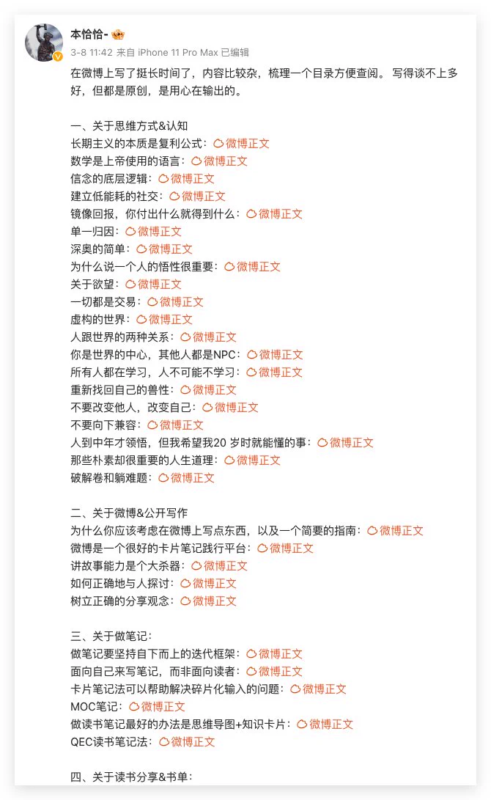
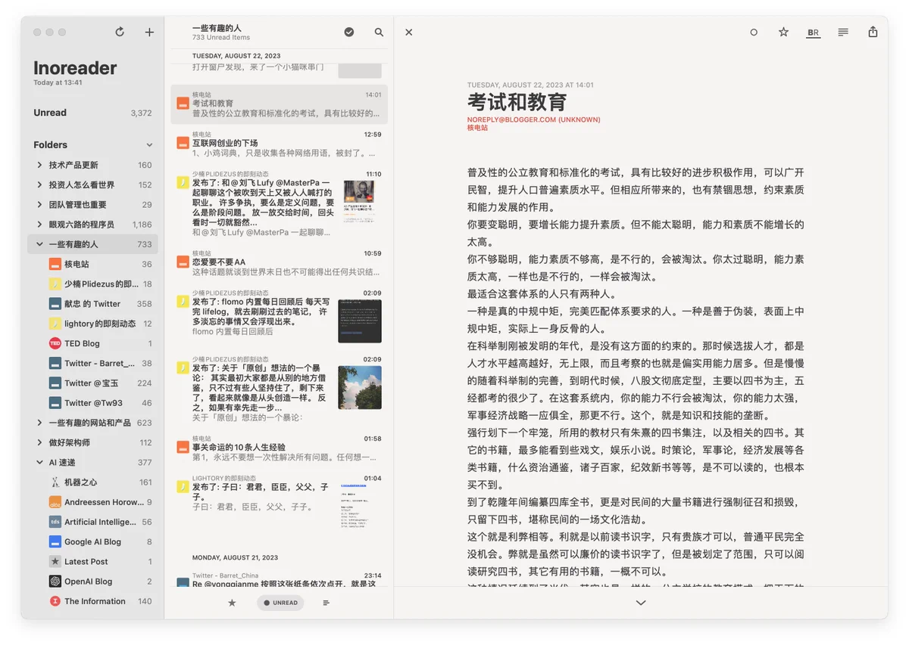
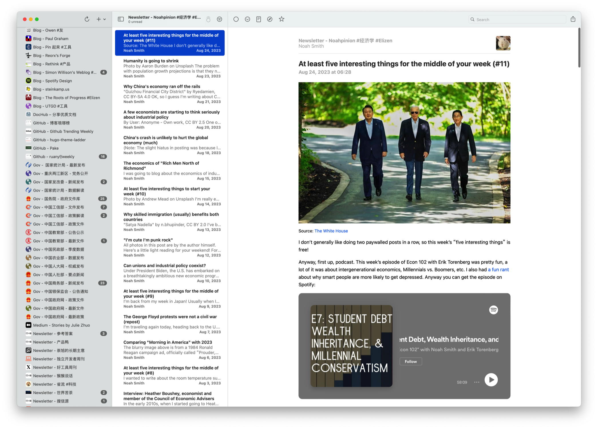
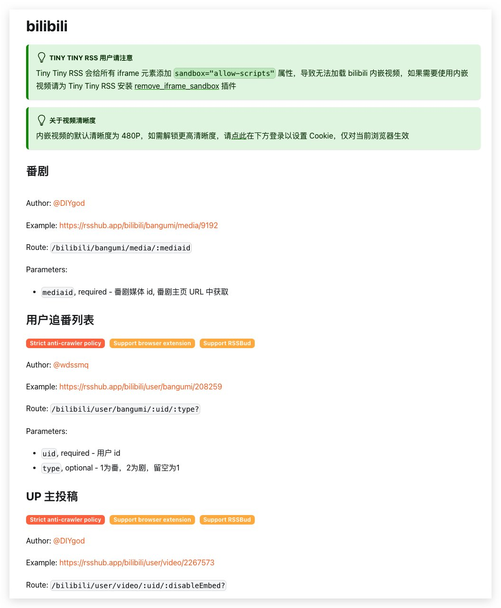

我在[社交媒体][1]上给读者推荐了一位宝藏博主，

很多人觉得内容还不错，但也开始犯愁了，原因是这个博主人在微博上，可自己的微博却已尘封多年，不想去关注。那有没有办法在不打开微博的同时，又能够获取到这位博主的输出呢？要知道，在互联网上，类似微博的平台还有很多很多，我们会无数次错过这样的宝藏博主。

## 不可控的信息流

其实大家对信息流这个概念已经再熟悉不过了，点开淘宝，首屏就是一个调和了你胃口的商品信息流，点开今日头条、点开抖音，映入眼帘的均是信息流，只不过承载信息的载体略有不同，有的是一个图文列表，而有的是一个视频列表，我们无时无刻不沉浸在各式各样的信息流之中。值得一提的是朋友圈，它是一个较为特殊的信息流，由你关注的朋友所产生的内容所构成，但随着微信成长了十年，大多数人的朋友圈也早已泛滥。

如果你跟我一样，不想安装太多的客户端，不想被太多无关的信息干扰，又想把自己关心的信息聚集到一处，那么接下来就是你关心的内容了。

## 构建属于自己的信息流

如何把散落在各个平台的「宝藏」信息给聚合起来，放到一块儿关注呢？长话短说，我来提供一点工具和线索，下图是构建的效果图：

1）**你需要一个 RSS 阅读器**，我推荐 Reeder 5，Mac/iPhone/iPad 三端体验都没有太多可挑剔的地方，关键是它支持滚动代替已读，有些看了标题就不想点进去的内容，只要滚动条滚过去，就会自动标记为已读，如果你是一个经常上千未读的订阅者，这个功能很减压，它是收费的；有一个体验稍微弱一点的免费产品，NetNewsWire，我也体验过一段时间，还不错；

2）**你需要一个将任意内容转换成 RSS 的工具**，我推荐 RSSHub，<https://docs.rsshub.app>，它目前已经把主流媒体和渠道的内容转化成了 RSS；你也可以自己去定制，将互联网上喜欢的内容转换成 RSS；

3）我建议你找一个 RSS 平台，注册一个账号，来**管理 RSS 集合**，一方面可以方便你在多个平台之间同步数据,包括订阅源的增删改查，以及已读、未读、收藏等状态的同步，另一方面也可以很好地支持多人协同，例如分享你的订阅给他人，或者将他人的订阅转为自己的订阅等等；我调研了不少类似的产品，最后选择的是 Inoreader，<https://inoreader.com>，虽然也是收费产品，但免费额度足够使用；

接下来需要做的事情，就是去寻找自己喜欢的内容啦，这是一件长期的工作，不断去扩充自己的阅读边界；更重要的是，需要时常维护自己的订阅源，例如某些长期被略过的内容，即便偶尔出现一点点好的内容，也应该果断放弃，因为筛选成本太高了。

## 关于构建过程中的一些疑惑

RSS 可以说是上个互联网时代的产物，随着 Google Reader 的下线，RSS 也已宣布死亡，在国内，类 RSS 工具甚至在 APP Store 上都找不到了，具体缘由本文不继续拓展。

找到一个自己用的趁手的 RSS 阅读器会是一个首选命题，很多 RSS 聚合平台，例如 Feedly/Inoreader/NewsBlur 等等，都会研发自己的 RSS 阅读器，如果你用得习惯，觉得体验上完全可以满足自己的需求，那么上述构建过程的第一步是可以省略的。

大多数的 RSS 阅读器都可以变成一个 Local Only 的工具，再利用类似 iCloud 作为数据中介便可以实现 RSS 源的多端同步，那为啥我还推荐你找一个平台注册一个账号来管理 RSS 呢？前文已经做出了简单的解释，其实除了体验以外，最重要的还是平台会有更多的优势，例如它会帮你探索内容，当你找到了 `A` 时，借助平台你可以找到更多 `A'`；再例如，平台提供了智能监测和过滤的能力，有读者[提到][4]：

> 我之前用的 Inoreader ，核心功能是关键词监控，非常喜欢；其次是关键词过滤，设置规则后可以自定义动作。今年换了 NetNewsWire 这个免费客户端，似乎也够用。我的源是动态更新的，主要是博客、newsletters 、政务信息、媒体等。
> 

[RSSHub][2] 这个项目已经开源了很多年了，它内置了大量平台的信息源订阅能力，例如 Bilibili/Twitter/Weibo/Youtube 等等：

你需要做的，就是上去找到自己需要的博主，然后把对应的 ID 给扒拉下来，拼接成 RSS 源，加入到你的 RSS List 就行了。

## 去行动

或许你十分享受沉浸在不同社交媒体带来的信息流体验之中，那这个工具可能也不会适合你。有的人会觉得这个操作有点硬核，上手成本略高，我只能说，所有的一切都在那里，有的人看到以后会去实践，而有的人只是把本文收藏起来，然后尘封。🐶

工具的构建只不过是起步，关键在于持续挖掘对自己有益的信息源，不断拓展自己的阅读边界。再次强调，在构建信息源的过程中，需要长期保持对信息源结构和内容的更新，确保获得的信息是对自己有效且能够产生认知增强的，**否则，所有的行动，只不过是给自己构建了另外一个信息蚕房罢了。**

[1]: https://twitter.com/Barret_China/status/1694903398523347211
[2]: https://docs.rsshub.app
[3]: https://inoreader.com
[4]: https://web.okjike.com/originalPost/64e84610c70326f2eb30947a