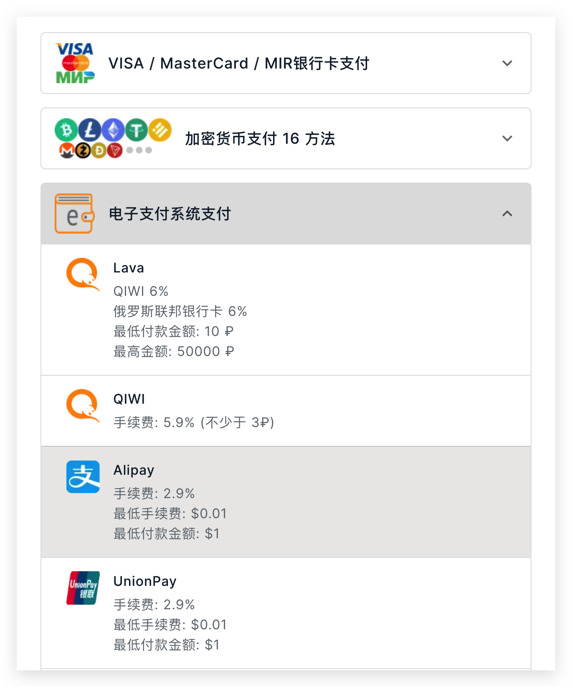
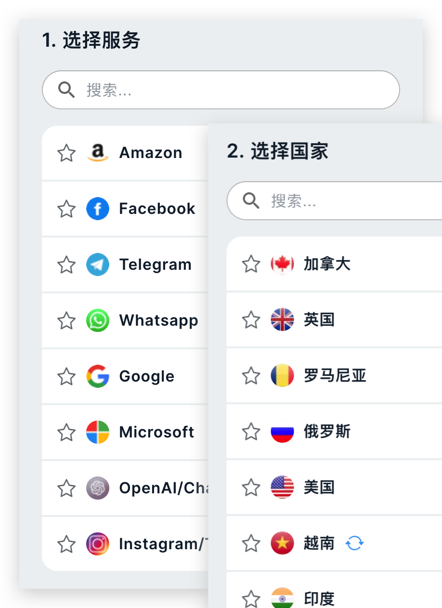
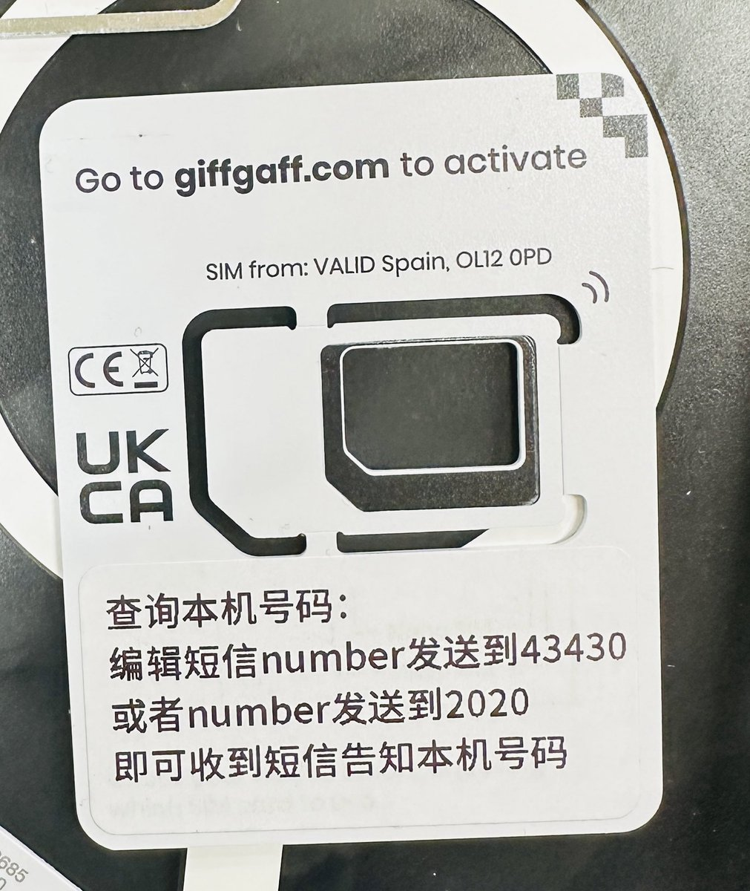

如果你注册和使用过 ChatGPT，那你对这篇文章要解决的问题就会深有感触，注册时使用邮箱登录后，OpenAI 会要求你绑定一个手机号码，而这个手机号码不允许是中国大陆区的，很多人都会卡在这一步。

有两条路径来解决这个问题，1）使用接码平台，临时租一个非大陆手机号码，用来接受验证码；2）你可以直接购买一张非大陆区的手机卡。本文会告诉你，这两条路径分别该怎么走。

## 接码平台

接码平台，顾名思义，就是能够接受手机验证码的平台，事实上，在中国，搭建接码平台是存在巨大法律风险的，这里有一篇由检察院出具的[《接码平台相关方行为的刑事定性》][1]，可以参阅，摘要如下：

> 接码平台相关方通过接码平台大量获取手机号和验证码，并据此批量注册转化成互联网账号，源源不断地为下游黑灰产业“输血供粮”，为黑灰产从业者筑起了隐匿身份的巨大屏障，具有较大的社会危害性和法益侵害性。现阶段对接码平台相关方行为的刑事规制仍待加强，可通过分析接码所涉主体、运行过程等，区分实名卡和非实名卡，以对接码平台相关方行为予以精准刑事定性。

本文提到的接码平台，都是国外的平台，接码范围是全球手机号码，作为使用方，主要用途在于注册海外的产品或者应用。

市面上接码平台不胜枚举，我平时用的比较多的主要是两个，一个是 [5sim.net][2]，另外一个是 [sms-activate.org][3]，它们支持全球 170+ 个国家的手机验证码。这两个平台都支持使用信用卡或者支付宝进行充值，也支持其他超丰富的支付方式：

如果你经常使用的话，可以考虑充个 5~10 美金进去，省得未来需要经常打开支付宝进行充值。使用也是比较简单的，先选择服务然后选择国家，例如你要注册 ChatGPT 就选择 OpenAI 服务，然后选择一个国家的号码，不同国家的费用差异较大，例如美国就比印度要贵很多，

号码选好之后，就可以看到一个等待接受验证码的界面了，你可以在验证码发过来之前取消选号，这个时候是不收费的。整体交互很容易看懂，这里不再赘述。

唯一需要注意的是，**只要平台接收到了验证码，就会完成扣费动作**，无论你的注册或者登录是否成功，而且你无法长期租用同一个手机号码，所有的接码都是一次性使用，因此，对于较为敏感的需要长期固定手机号码来验证的账户，不要使用接码平台。

## 海外手机卡

对于跟资金、信用等相关的平台，更建议使用长期不变的号码。有研究过 Google Voice，但是网上看到好多保号失败的案例，加上近期 Google 对这一块做了更严格的调整，号码丢失的概率偏大，因此更建议购买实体卡。

去网上搜到比较多的是美国 Paygo、英国 giffgaff 和新西兰 Skinny，详情可以戳 [这个帖子][6]。

### 美国卡

美国卡分好几种，有最便宜的 Paygo，一个月 3 刀的基础费用；也有橙卡，橙卡的优势是无限通话、无限短信和流量上网，需要注意的是，通话过程要开启 WiFi-Calling，否则费用会比较贵，它的另外一个优势是，上网的时候出口 IP 是美国本地 IP，部分场景下比较有用。

橙卡月租最低 10 美元，需要一年充值 120 美元或者每月 15 美元。我发现挺多网友都选择了 Paygo。

### 英国卡

英国卡也分好多种，除了 giffgaff，还有 Three/EE/O2 卡，giffgaff 是这几种里头卖的最火的。

简单介绍下这张卡，因为我刚好买的就是这样：

1. giffgaff 有多种套餐，不同套餐存在不同时效性，例如 30/90/180 天，一般适合旅游使用，到期了号码就被回收了
2. 购买可以选择套餐，有几个套餐是不会被回收，不过要求定期消费，超过 180 天不消费，号码仍然会被回收掉，消费后会继续延长 180 天，所谓的消费：`发一条短信或者打一个电话`
3. 有些套餐买卡的时候，卡里头会有几英镑的余额，用完了就得充值，可以去它的官网 [giffgaff.com][4] 进行充值，但是需要有国际信用卡或者国际 PayPal，这条路一般人都走不通；但是有网友反馈，中国的卡也行

giffgaff 的最大优点就是零月租，缺点是保号费劲。我是在某宝上购买的，98 块的卡，第二天就到了，里头有 15 英镑，每半年内消费一次（发短信打电话都行）便可继续保号半年，感觉可以用个五年八年的了……关于保号，官方的说明：

> To stop deactivation do any one of the following actions at least once every 6 months:
> - Make at least one call, SMS or MMS to another number
> - Make at least one connection to the internet using your mobile data

不在某宝购买也可以获得，你可以去它的官网申请一张，会平邮寄过来，差不多一两周能到。

### 新西兰卡

新西兰的 Skinny 我没有具体研究，看网友说，海购 200 左右，零月租，一年充值一次，可保号。因为先看到 giffgaff，而且有同事在用，就没有过多研究其他卡种了。

## 小结

总体来看，美国卡成本略高一点，如果你是一个数字游民，在做出海的业务，且市场人群主要在美国，那还是比较建议你搞一张美国手机卡；但如果你只是想在网上消费一些海外产品，英国卡、新西兰卡等，都是够用的，成本也不算高。

[1]: https://www.toutiao.com/article/7119772491043750432/
[2]: https://5sim.net
[3]: https://sms-activate.org
[4]: http://giffgaff.com
[6]: https://twitter.com/Barret_China/status/1638404990715961345