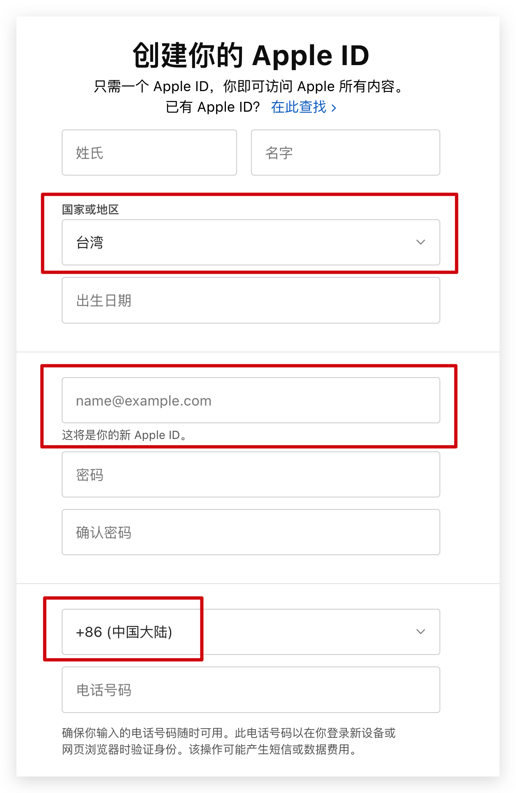
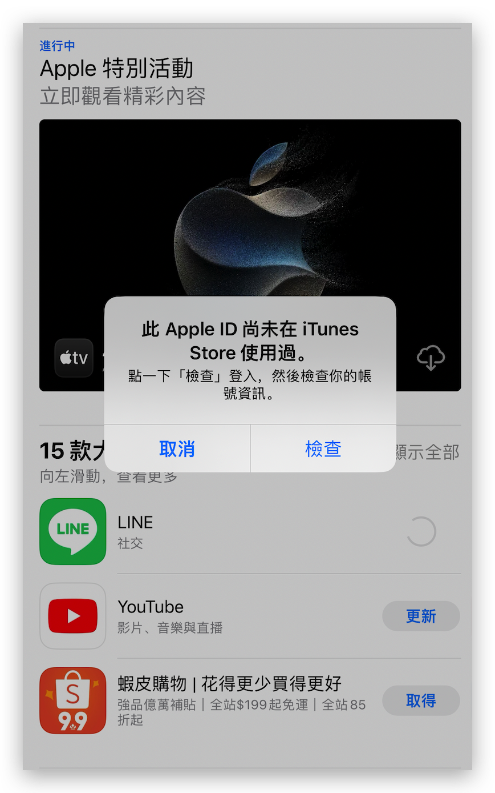
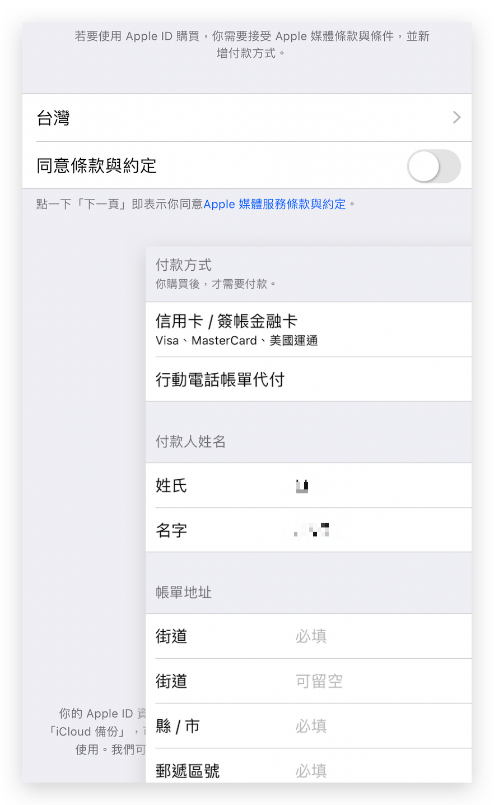
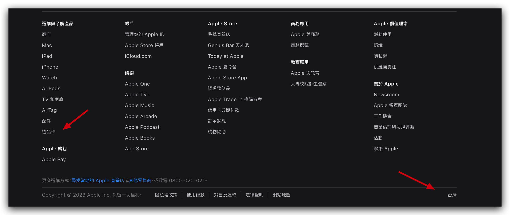
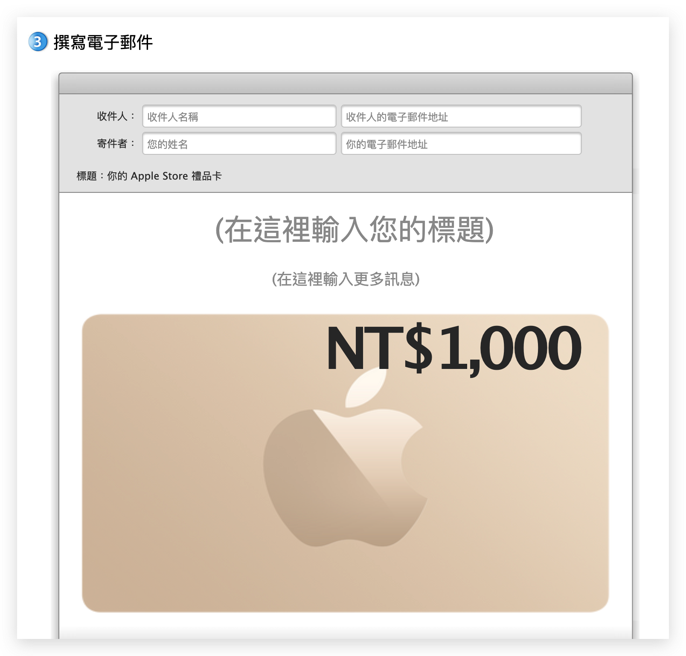
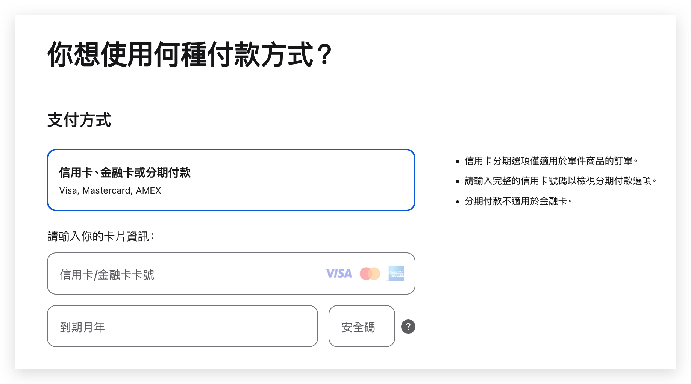

title: 美区 App Store 账号和礼品卡
description: >-
  如果你要在非中国大陆区下载和体验产品，躲不过的第一个门槛是，你得有对应国家或地区的 App Store
  账号，很多年前我在某宝上买了一个美区账号，用了几年之后，突然不可登录了，由于没有及时修改账号绑定的邮箱和手机号码，目前已经无法完成风险验证，相当于这个账号就没了。
warning: true
tags:
  - 小胡子哥的思源地
categories:
  - 随笔
  - 数字游民
author: Barret李靖
date: 2023-09-14 09:11:01
---
AI 盛行的当下，很多人都满怀好奇心，想一头扎进去看个究竟，而国内因为政策原因，AI 产品几乎已全被下架，未来需要经历类似备案流程才有机会重新上架自己的产品，因此大量开发者把自己的 AI 服务瞄向了海外市场，在 App Store 上也只在非中国大陆区上架自己的产品。

如果你要在非中国大陆区下载和体验产品，躲不过的第一个门槛是，你得有对应国家或地区的 App Store 账号，很多年前我在某宝上买了一个美区账号，用了几年之后，突然不可登录了，由于没有及时修改账号绑定的邮箱和手机号码，目前已经无法完成风险验证，相当于这个账号就没了。

事实上，申请一个其他国家或地区的 App Store 账号并不麻烦，本文的目的就是带你自助申请一个属于自己的账号，同时教你如何完成付费软件的下载。

## 账号创建流程

以申请一个台湾省的 Apple Id 为例，首先打开 [appleid.apple.com](https://appleid.apple.com)，进入到创建流程，你会看到一张 Apple Id 的申请表单，

App Store 账号的申请需要有手机号码验证，让人释怀的是，它并没有强制要求你使用当地的手机号码来验证信息，因此使用你的 `+86` 就行了。

> 要知道很多软件（例如 ChatGPT/Claude 等）的注册和使用，不仅要求你的 IP 是非中国区的，还要求你注册时用于验证的手机号码也是非中国区的，如遇到这类问题，可参阅前文 [《非大陆手机验证码和国外手机卡》](/blog/2023/09/13/non-chinese-phone-checkcode-and-uk-giffgaff) 进行操作。

填写完成后，会要求你验证邮箱和手机号码，验证完成，账号就到手了。此时的账号在登录到手机进行软件下载时，会出现如下提醒：

首次使用 Apple ID 下载软件，苹果要求你填写两个信息：

1. 同意所在国家或者地区的协议，勾选下就好了
2. 补充和完善你的地址信息，因为在 APP Store 购物是需要账单地址的，虽然现在基本都是走电子账单，你也是可以要求它提供纸质账单的

如下图所示：

很显然，你是没有其他国家或者地区的居住地址的，不过这里可以随便填写，去 Google 上搜一下「地址生成器」，能找到很多辅助工具。完成这个配置以后，你就可以顺利下载软件了。

**在上方填写账单地址信息时，无需配置付款方式**，因为你没有对应国家或地区的付款工具的，置空就好，填写账单地址时确保地址+邮编是匹配的就行了，如果不匹配，那说明你的地址生成器有问题，或者填写的邮编位数不对，例如我测试的时候，地址生成器给出的台湾省邮编是 6 位数，可 App Store 只需要你填写前 3 位就够了。

## 礼品卡：付费软件下载

App Store 在不同国家和地区支持的付款方式有所差异，例如在中国支持银行卡、微信和支付宝等进行支付，在台湾省支持的方式就是银行卡或者电话代付，在美国还支持 Paypal。不是所有的银行卡都可以直接完成绑定的，必须是所在国家或地区的申请的，例如你在美区绑定中国的 Visa/MasterCard 就会失败。

我没有 Paypal，没有对应地区的银行卡，也没有对应地区的手机号码，怎么办？有两条路径可以解决这个问题，一个是你去申请对应国家或者地区的银行卡，例如之前有一篇文章提到，使用全部大陆身份信息就能免费申请一张 [新加坡华侨银行 OCBC 的银行卡](/blog/2023/09/06/ocbc-bank/)，有了新加坡区的 App Store 账号，又有了新加坡的银行卡，自然就可以完成付费绑定了，这条路很折腾。

另外一个方式也比较简单，你可以使用礼品卡（Gift Card）进行付款，礼品卡相当于一张定额的充值卡，可以给你的 Apple ID 充值金额，它的购买渠道也比较多，大多数人都会选择直接从淘宝咸鱼上购买。下面我告诉你两个其他的通道，也十分便捷。

### 在 Apple 官网购买礼品卡

Apple 的官网是 [apple.com](https://apple.com)，点击进入到官网后，下拉到最底部，将地区切换到你 Apple ID 账号所在的区域，然后在底部找到 Gift Card 的购买入口：

依次按照流程进行购买即可。需要注意的是，不同区域的流程略有差异，例如美国就是直接选择礼品卡，然后付费；而在台湾省，则是让你将礼品卡赠送给其他人，你需要填写金额然后填写邮箱信息，最后会给你定制成一封包含礼品卡信息的邮件：

上图中，你全部都填自己的电子邮件就好了。填写完之后下单，也会进入到支付流程：

这里支持中国的 Visa/MasterCard 信用卡进行支付，支付完成就会立刻给你的邮箱发送礼品卡的信息啦。

### 在支付宝上直接购买

目前我只找到了美区的礼品卡购买渠道，其他渠道，例如土耳其，还是建议直接上官网或者找淘宝咸鱼购买。这是网友给我留言提供的操作路径，我走过这个流程，是可以成功购买的：

> 支付宝地区改成美国城市，点击底部 “出境” tab 的 “折扣礼卡” 里，滑到最底部 “更多大牌折扣礼卡” ，点击打开后，找到 App store & itune，点击购买后会给你兑换码然后复制下，点击app store顶部右上角里的兑换充值码，充值就行了

不过今天去看的时候，发现支付宝的 UI 已经改版了，为了避免大家找不到，我还是截了个图，它藏的实在有点深：

**1. 切换到美区地址后，往下拉，在汇率卡片下面，有一个礼品卡入口**

**2. 点击进去后，拉倒最底部，找到「更多大牌折扣礼卡」入口**

**3. 点击进去后找到苹果礼品卡入口，在列表中，比价醒目**

它支持 2 到 500 美金的任意额度进行充值，**存在支付失败的可能，多尝试几次就好了**，大概会在付款结束后的 15min 内在当前账户的个人页里头发卡号给你，交易前多看看文字提醒。

### 付费失败？？？

成功购买了 Gift Card，在尝试购买软件的时候，却失败了，提示「Your Purchase Could Not Be Completed」相关异常？

这也是比较正常的现象，如果你是新账号，然后立马充值了礼品卡，在点击付费软件下载的时候，**会触发风控，一天后重新尝试就好了**，如果持续失败，你倒是可以联系下客服，告诉他你购买礼品卡后付费持续失败，要求退款，他们肯定会帮你处理好的。

另外，如果绑定了对应地区的银行卡或者其他付款方式，风控会立即解除。

## 小结

你看看，够不够折腾，下载个软件，又是要申请 App Store 账号，又是要购买礼品卡，到最后还来一个风控无法完成付费。不过这些工作，也就是折腾一次，前前后后快的话，半个小时内可以搞定，倒也是可以接受的。

不知道未来苹果在整个流程上会不会再增加门槛，如果需要经常在境外 App Store 上下载软件，不妨找个时间，折腾下，先备着吧。